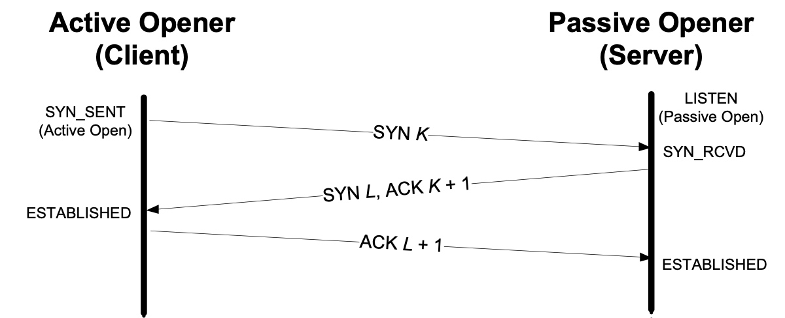
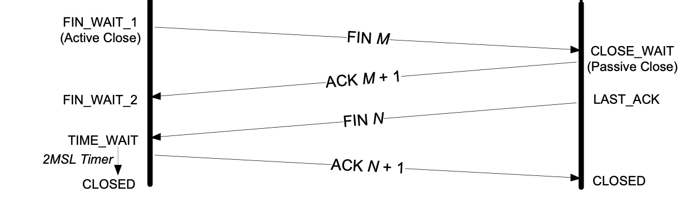
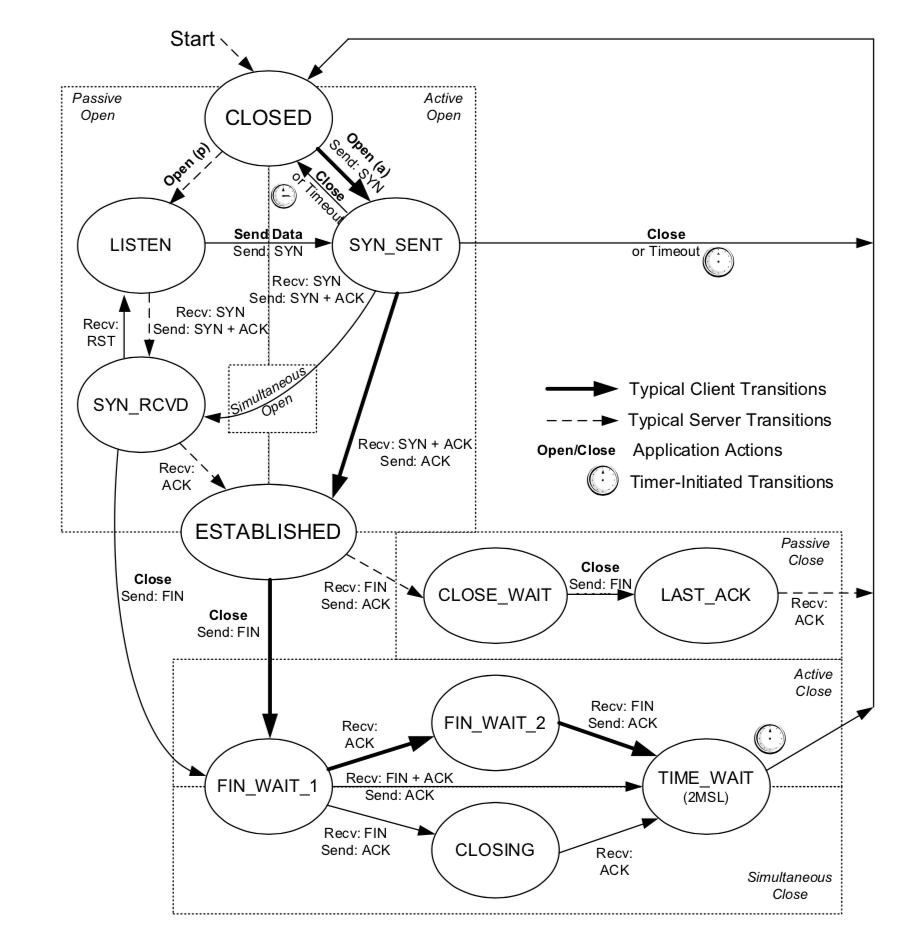
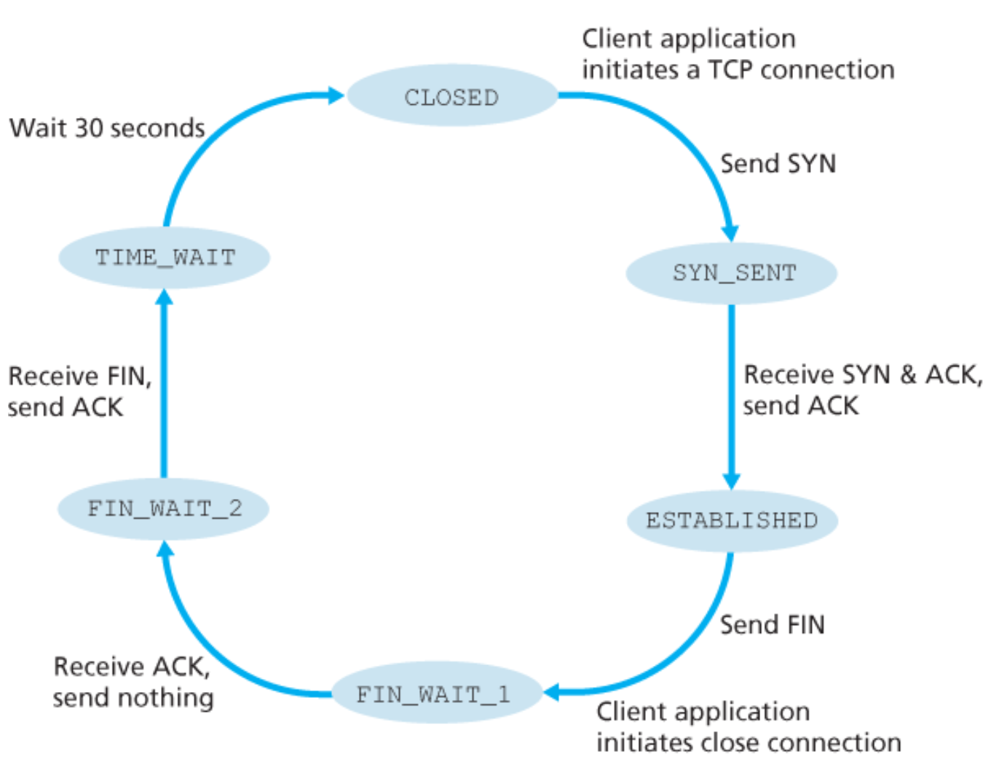
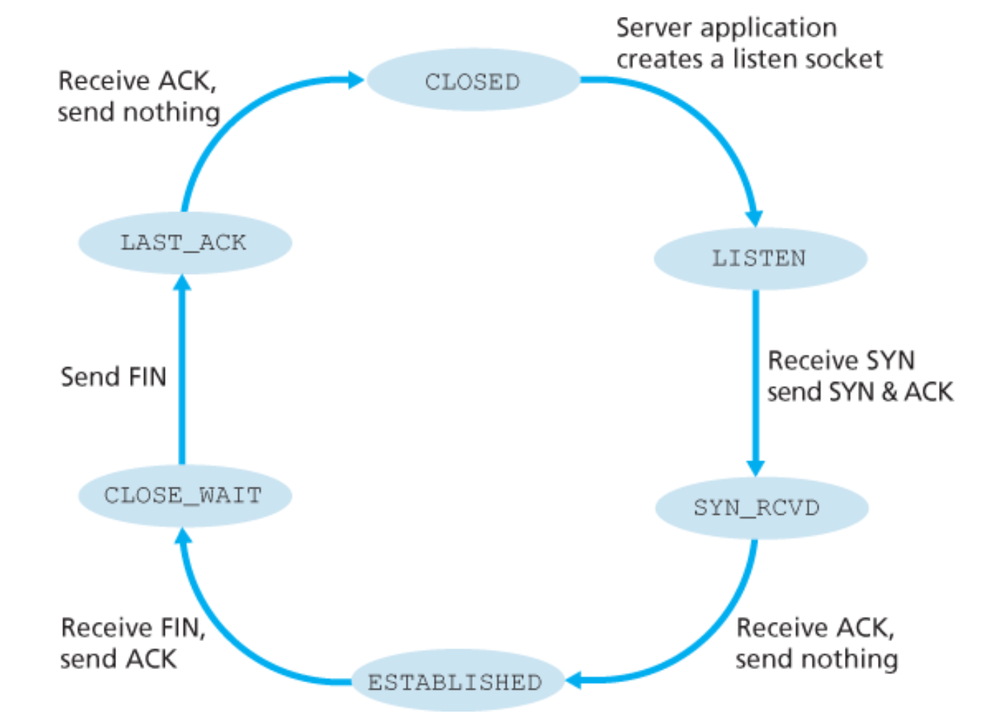
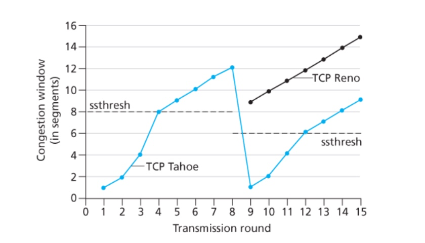

## 计算机网络

### TCP/IP协议栈

TCP/IP协议栈一共有4层，从下到上依次为链路层、网络层、传输层、应用层。

* 应用层是网络应用以及应用层协议工作的的地方。
* 传输层提供了两个不同主机进程之间直接通信的服务。
* 网络层提供了主机到主机之间的直接通信服务。
* 链路层提供了相邻主机之间的通信服务。

### 在浏览器内输入URL（如www.baidu.com）后执行的全过程

* 通过DHCP协议获得一个IP地址。
* 执行域名解析。首先从浏览器和缓存文件中查找目标主机的IP地址，如果这个地址不存在，使用DNS协议获得目标主机的IP地址。
* 由于HTTP工作在TCP协议之上，因此需要建立TCP连接（三次握手）。连接建立完成后，浏览器向服务器发送请求报文。
* 服务器处理发送的请求，并返回HTTP响应报文。
* 浏览器接收返回的响应，并渲染展示给用户。

### DNS的实现原理

DNS服务器分为三个层级：根DNS、顶级域DNS、权威DNS。

### HTTP报文格式

HTTP报文分为请求报文和相应报文。

HTTP请求报文包括以下结构：请求行、请求首部字段、实体。

其中，请求行描述了客户端想要如何操作服务器端的资源，包括以下字段：请求方法、请求目标、版本号。

HTTP相应报文包括以下结构：状态行、相应首部字段、实体。

其中，状态行描述了服务器响应的状态，包括以下字段：版本号、状态码、原因。

### HTTP请求方法

请求方法是客户端发出了一个“动作指令”，要求服务器端对 URI 定位的资源执行这个动作。

常用的请求方法如下：

* GET：获取资源。
* HEAD：获得资源的元信息，但不会获得资源本身。
* POST：向资源提交数据。
* PUT：类似POST。
* DELETE：删除资源。
* CONNECT：建立特殊的连接隧道。
* OPTIONS：列出可以支持的方法。
* TRACE：追踪请求 - 响应的传输路径。

### GET和POST的区别

* GET是幂等的，多次执行同样的操作不会改变返回的结果。POST操作不是幂等的，多次提交数据会创建多个资源。
* GET会把请求参数附在URL后面，而POST则把请求参数写在报文实体中。
* 浏览器和服务器对GET的URL长度会有限制，而POST传输的参数大小没有限制。

参考：[https://stackoverflow.com/questions/504947/when-should-i-use-get-or-post-method-whats-the-difference-between-them](https://stackoverflow.com/questions/504947/when-should-i-use-get-or-post-method-whats-the-difference-between-them)

### HTTP返回状态码

状态码描述当客户端向服务器发送请求时，请求的**响应结果**。

|      |            类别            |         原因短语         |
| :--: | :------------------------: | :----------------------: |
| 1XX  | Informational（提示信息）  |    接收的信息正在处理    |
| 2XX  |      Success（成功）       |     请求正常处理完毕     |
| 3XX  |   Redirection（重定向）    | 需要进行附加操作完成请求 |
| 4XX  | Client Error（客户端错误） |    服务器无法处理请求    |
| 5XX  | Server Error（服务端错误） |    服务器处理请求出错    |

部分常用状态码如下：

* **101 Switching Protocols**：要求在HTTP协议的其他基础上使用其他的协议继续通信。
* **200 OK**：一切正常。如果不是GET请求，响应头后面会有数据。
* **204 No Content**：响应头后面没有数据。
* **206 Partial Content**：body只有一部分数据。
* **301 Moved Permanently**：永久重定向。表明此次请求的资源已经不存在了，需要改用改用新的URI再次访问。
* **302 Found**：临时重定向。表明请求的资源还在，但需要暂时用另一个URI来访问。
* **304 Not Modified**：缓存重定向。表示资源未修改，用于缓存控制。
* **307 Temporary Redirect**：临时重定向。
* **400 Bad Request**：表示请求报文有错误，但只是一个笼统的描述。
* **403 Forbidden**：服务器禁止访问资源。
* **404 Not Found**：资源在本服务器上未找到，所以无法提供给客户端。
* **500 Internal Server Error**：表示服务器内部出错，但只是一个笼统的错误。
* **502 Bad Gateway**：服务器作为网关或者代理时返回的错误码。表示服务器自身工作正常，访问后端服务器时发生了错误
* **503 Service Unavailable**：服务器当前很忙，暂时无法响应服务。通常会有一个“Retry-After”字段，指示客户端可以在多久以后再次尝试发送请求。HTTPS的具体过程

### 301和302的区别

301 表示的意思是“永久重定向”（Moved Permanently），意思是原 URI 已经“永久”性地不存在了，今后的所有请求都必须改用新的 URI。浏览器看到 301，就知道原来的 URI“过时”了，就会做适当的优化。比如历史记录、更新书签，下次可能就会直接用新的 URI 访问，省去了再次跳转的成本。搜索引擎的爬虫看到 301，也会更新索引库，不再使用老的 URI。

302 表示的意思是“临时重定向”（“Moved Temporarily”），意思是原 URI 处于“临时维护”状态，新的 URI 是起“顶包”作用的“临时工”。浏览器或者爬虫看到 302，会认为原来的 URI 仍然有效，但暂时不可用，所以只会执行简单的跳转页面，不记录新的 URI，也不会有其他的多余动作，下次访问还是用原 URI。

参考：[https://stackoverflow.com/questions/1393280/http-redirect-301-permanent-vs-302-temporary](https://stackoverflow.com/questions/1393280/http-redirect-301-permanent-vs-302-temporary)

### Cookie和Session

### HTTP和HTTPS的区别

### HTTPS的具体实现

### 数字证书

### HTTP/2

HTTP/2主要解决以前HTTP版本存在的性能问题（安全问题由HTTPS解决）。主要包括以下几个改进点：**头部压缩**、**二进制帧**、**多路复用**。

**头部压缩**

由于报文Header会携带多达数百上千的字节，而Body部分通常只有几十字节，这样会造成大量的带宽消耗。HTTP/2采用了以下几种改进方式：

* 在客户端和服务端建立字典，用索引表示重复的字符串。
* 使用哈夫曼编码压缩数字和字符串。

**二进制帧**

使用二进制格式，把消息打散为多个二进制帧。“HEADERS”帧存放头数据、“DATA”帧存放实体数据。

**多路复用**

HTTP/2使用**“流”**表示二进制帧的双向传输序列。每个帧都有一个唯一的编号，接收方通过这个编号可以还原原本的报文，基本解决了队头阻塞问题。

### QUIC

QUIC是用于解决TCP协议栈出现的队头阻塞问题。

### TCP/UDP报文格式

TCP报文主要包括以下字段：源端口号、目的端口号、校验和、序列号、确认号、校验和、标志位、首部长度等。

UDP报文主要包括以下字段：源端口号、目的端口号、校验和、长度。

TCP首部中的选项数量是不确定的，所以需要一个首部长度字段。

UDP首部长度的固定的，不需要首部长度字段。

**TCP中重要的标志位**

* ACK：表明该报文是一个确认报文。
* SYN、FIN：和连接的建立释放相关。
* 

### TCP和UDP的区别

* TCP是面向连接的服务。当两个进程可以互相通信之前，需要执行一个“握手”过程，建立一条全双工的连接。UDP提供的是无连接服务，两个进程通信之前无需建立连接。
* TCP提供可靠传输服务，保证无差错并按顺序交付发送的数据。UDP没有提供可靠传输服务，发送的报文不保证能够到达接收进程，报文的到达顺序也可能是乱序的。
* TCP提供了流量控制和拥塞控制机制，而UDP没有。
* TCP是面向字节流的协议，把发送数据视为连续的字节流，使用序列号标记第一个字节的位置，因此数据包是没有边界的，可能会造成粘包问题。UDP是面向数据报的协议，每个报文之间都有边界，不会出现粘包问题。
* TCP发送数据前需要建立连接，消耗的时间更多，同时需要更多的资源（发送端和接收端的缓存、拥塞控制参数、确认号和序列号）保证可靠传输。

因此，如果应用需要较高的正确性，应使用TCP作为传输层协议。如果应用对时延敏感，并且容忍一定程度的报文丢失，应使用UDP作为传输层协议。

### UDP报文分片

### 可靠传输实现机制

1. 校验和：验证传输的数据是否出错。如果发现数据传输错误，需要及时抛弃。
2. 序列号：

### TCP三次握手与四次挥手

**三次握手**

1. Client 发送一个 SYN 报文段，指明连接的端口号以及初始序列号x。 (SYN)
2. Server 收到请求报文后，如果同意建立连接，向 Client 发送连接确认报文。确认号x+1,同样指明一个初始序列号y。(SYN+ACK)
3. Clinet 收到报文后,需要发送确认报文。确认号为y+1，序列号为x+1。 (ACK)

**四次挥手**

1. 主动关闭方（一般是Client）发送FIN报文，告知对方自己的当前序列号（M）。同时，还带有一个ACK段用于确认对方发送的上一个报文。（FIN）
2. 被动关闭方（一般是Server）将M加一作为自己的确认号，表明自己收到了对方发送的FIN报文，关闭本方向的TCP连接。（ACK）
3. 被动关闭方发送自己的FIN报文，该报文的序列号为N。（FIN）
4. 主动关闭方发送ACK报文，确认自己收到FIN报文，确认号为N+1。（ACK）

### 为什么需要三次握手？不能两次握手或者四次握手？

三次握手的目的是TCP通信双方交换各自的初始序列号，这是TCP能够可靠通信的保证。并且，TCP在保证可靠连接的同时，需要尽可能提高传输效率。

如果采用二次握手，可能会出现以下的问题：

 - 只有客户端能够确认服务端的初始报文号，服务端不能确认客户端的初始报文号。
 - 历史连接重复初始化。如果只有两次握手，发送方发送一次连接请求后，无法撤回当前连接，服务端无法判断是建立连接的请求还是延迟的过期请求。而三次连接把判断历史连接的任务交个了客户端。

如果采用四次握手，那么服务端收到客户端的SYN报文后，先发送ACK报文，过一段时间再发送SYN报文。这两个报文可以合并为一个报文发送，提高效率，用**更少的通信次数**（理论上的边界）完成信息的交换。

### 为什么要四次挥手？

因为TCP是全双工的协议，有可能出现只有一个方向传输数据的情况。每个方向的连接都需要独立地关闭。TCP半关闭每次回关掉一个方向的连接，只有执行两次半关闭操作才能关闭一个TCP连接。

### 连接建立超时

常见的连接建立超时的原因是服务器关闭。此时，客户端会采用指数回退的方式（每次报文发送的等待时间是上一次的数值的二倍。）频繁发送SYN报文段，直至达到初始SYN的发送次数（默认为5）。同理，若客户端在第三次挥手时迟迟没有响应，服务端也会持续发送SYN+ACK报文 。

可以通过更改操作系统的相关参数修改发送报文的次数。
* 客户端参数：net.ipv4.tcp_syn_retries
* 服务端参数：net.ipv4.tcp_synack_retries

### 如何选择初始序列号？

### SYN洪泛攻击

SYN洪泛攻击指的是，攻击者发送大量的TCP SYN报文段，却不执行第三次握手的步骤。服务器为这些半开的连接预留的资源，导致服务器的连接资源消耗殆尽。SYN cookie可以解决这个问题。当SYN报文到达时，服务器先不会分配资源。服务器生成一个特殊的初始序列号，称为“cookie”，作为自己的初始序列号。当客户端ACK报文到达时，服务器会检查确认号，如果判断是合法的，服务器就会创建一条连接。

### TCP状态转换

**TCP状态转换图**

**TCP客户端的典型状态转换序列**

**TCP服务端的典型状态转换序列**

### TIME_WAIT状态

TIME_WAIT 状态需要等待2MLS（最大段生存期）的时间，又称为加倍等待。最大段生存期代表的是一个报文在网络中被允许存在的最长时间。

**为什么需要等待2MLS？**

* **可靠的实现TCP全双工的终止**。假设四次挥手中的最后一个ACK丢失，那么被动关闭方就会重传FIN报文。假如此时主动关闭方不维护连接状态，会使用RST报文响应重传的FIN，这会在服务端被解释为一个出错。因此，2MLS中一个MLS被分配为ACK到达的时间，另一个MLS被分配为重传FIN到达的时间。
* **保证老的报文在网络中过期失效**。TCP的重传算法会导致可能生成重复报文，并且在连接终止后才到达。假设关闭连接后，客户端又使用了同样的端口建立新的连接，此时需要防止服务端把旧连接的重传报文当成新连接的合法报文。等待了2MLS后，重复报文和重复报文的响应都已经在网络中消失了，因此建立新连接不会出现问题。

### CLOSE_WAIT状态

### 延迟ACK和Nagle算法

### 滑动窗口协议

### TCP流量控制

流量控制是一种速度匹配服务，让发送方的发送速率和接收方的接受速率相匹配，防止接收方的缓冲区溢出。

TCP接收方会维护一个接收窗口（rwnd），

**零窗口**

如果TCP接收端已经没有可用的接受空间，会在报文段中把接收窗口的大小设置为0，可以有效阻止发送端继续发送数据，直至接收端有可用的接收空间。当接收端有可用的接收空间后，会向发送端发送一个窗口更新报文，通常是一个不含数据的纯ACK报文。

但是，TCP不能保证窗口更新报文是可靠传输的。如果发送端一直没有接收到窗口更新报文，会造成死锁现象。为了解决这个问题，发送端使用一个持续计时器，当计时器到期时会触发窗口探测，查看发送端窗口是否增长，要求接收端强制返回ACK。

### TCP拥塞控制

拥塞控制的目的是通过TCP每条连接的发送速率，防止用过多的流量淹没链路和交换设备，让所有的连接公平的共享拥塞带宽，这样可以给整个网络带来益处。TCP拥塞控制算法有四个部分：**慢启动、拥塞避免，快速重传和快速恢复**。

TCP发送方维护一个拥塞窗口（cwnd）控制TCP的发送速率。cwnd和rwnd中的较小值就是TCP发送方发送窗口的大小。

* **慢启动**：在慢启动阶段，cwnd的初始值为1，并且每当接收到一个ACK确认报文，cwnd的值就会加1。每经过一个RTT，cwnd的大小都会增加一倍。
* **拥塞避免**：此时，cwnd=ssthresh/2，如果cwnd还是指数增加，很容易造成网络拥塞。因此，在这个阶段，窗口增长的速度需要放缓。在这个阶段，每过一个RTT，cwnd的大小加1。如果出现超时，进入慢启动状态；如果出现冗余ACK，进入快速恢复状态。
* **快速重传**：如果发送端收到三个冗余ACK，说明网络中出现了丢包，需要重传。此时，每接收到一个冗余ACK，cwnd大小加1，
* **快速恢复**：

### TCP保活机制

