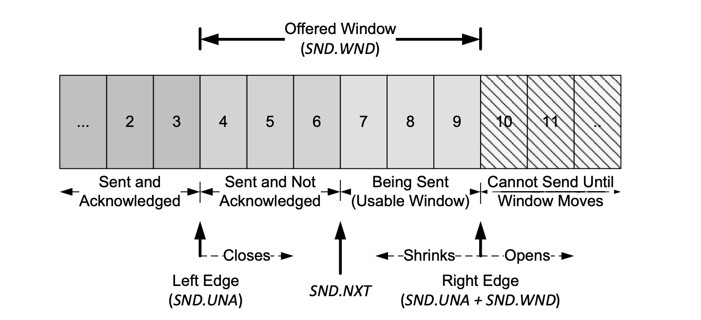

## 计算机网络


### 网络的几种分层体系结构

**TCP/IP协议栈**

TCP/IP协议栈一共有4层，从下到上依次为链路层、网络层、传输层、应用层。

* 应用层是网络应用以及应用层协议工作的的地方。
* 传输层提供了两个不同主机进程之间直接通信的服务。
* 网络层提供了主机到主机之间的直接通信服务。
* 链路层提供了相邻主机之间的通信服务。

**OSI分层体系结构**

OSI协议栈一共分为7层，从下到上依次为物理层、数据链路层、网络层、传输层、会话层、表示层、应用层。

* 链路层、网络层、传输层、应用层的作用和TCP/IP协议栈类似。

* 表示层让通信的应用程序能够理解交换数据的含义。
* 会话层提供了数据交换的定界和同步功能。

### 建立TCP服务器的各个系统调用

服务端：`socket(), bind(), listen(), accept()`

客户端：`socket(), connect()`

### close是一次就能直接关闭的吗？半关闭状态是怎么产生的？

在使用close()系统调用时，如果文件的引用计数为0，那么就会关闭这条连接，否则连接会继续存在。使用shutdown可以直接关闭一条连接的读端/写端，产生半关闭状态。

### MTU和MSS

MTU：最大传输单元。表示一条链路的最大帧长度。

MSS：最大报文段。传输层一次从缓存中发送的最大数据量受限于此。

MSS的大小受限于MTU，MSS加上TCP的首部大小和IP的首部大小等于MTU。常见的MTU大小为1500，因此MSS的典型大小是1460。

### 路由协议的了解与介绍


### ARP的过程

1. 主机构造ARP查询分组，适配器采用广播的方式发送该分组，查询IP地址对应的MAC地址是什么。
2. 接受到的主机检查这个分组，与之匹配的发送一个ARP相应报文给查询主机。

###  ping的过程分别用到了哪些协议

ping使用ICMP协议进行工作的，主要的流程如下：

* 客户端发送回显请求报文（ICMP类型8编码0）到指定主机。
* 主机收到报文后，发送回显相应报文（ICMP类型0编码0）到客户端。

traceroute同样使用ICMP协议，主要的流程如下：

* 

### DHCP的过程

1. DHCP服务器发现。客户端发送DHCP发现报文，发现可以与其交互的DHCP服务器。
2. DHCP服务器提供。收到DHCP发现报文的DHCP服务器发送DHCP提供报文进行相应。报文包含的内容有：发现报文的事务ID，推荐的IP地址、子网掩码、以及IP地址租用期。
3. DHCP请求。客户端选择一个DHCP服务器，并且发送一个DHCP请求报文。
4. DHCP ACK。接受到DHCP请求报文的服务器发送一个DHCP ACK作为响应。

### IPv4数据报分片

由于链路层MTU是不一致的，IP报文的大小可能会超过MTU的限制，因此需要执行数据报分片的操作。

IP分片到达了目的主机后需要重新组装，为了确定哪些IP分片属于同一个报文，IP协议提供了以下机制：

* 标识号：发送主机会为每个数据报加上一个标识号。
* 标志位：如果一个报文分片是最后一个，那么标志位为0，否则为1。
* 偏移字段：指示所有的分片按照什么顺序重新组装。也可以检测是否出现报文分片丢失的情况。

### 在浏览器内输入URL（如www.baidu.com）后执行的全过程

* 主机通过DHCP协议获得一个IP地址。
* 主机执行域名解析。首先从浏览器和缓存文件中查找目标主机的IP地址，如果这个地址不存在，使用DNS协议获得目标主机的IP地址。
* 由于HTTP工作在TCP协议之上，因此需要建立TCP连接（三次握手）。连接建立完成后，浏览器向服务器发送HTTP请求报文。
* 服务器处理发送的请求，并返回HTTP响应报文。
* 浏览器接收返回的响应，并渲染展示给用户。

### DNS层级结构

DNS服务器分为三个层级：根DNS、顶级域DNS、权威DNS。

* 根DNS提供了所有顶级域DNS的地址。
* 每个顶级域（如com，org，net）和每个国家的顶级域都会有顶级域服务器，负责提供权威DNS服务器的地址。
* 在因特网上具有可访问主机的所有组织都会维护自己的权威DNS服务器，提供了可访问的DNS记录。

同时，每个ISP还有本地DNS服务器，起到一个代理的作用，会把用户发送的DNS请求转发到DNS服务器层级中。

### DNS解析过程

DNS解析方法有两种：迭代查询和递归查询。

迭代查询的步骤：

1. 本机发送DNS查询报文给本地DNS服务器。如果本地DNS服务器有对应的记录，直接把记录返回。
2. 否则，本地DNS服务器向根服务器发送DNS查询报文，根服务器根据域名返回顶级域DNS地址。
3. 本地DNS服务器向顶级域服务器发送DNS查询报文，根服务器根据域名返回权威DNS地址。
4. 本地DNS服务器向权威服务器发送DNS查询报文，获得需要的IP地址。
5. 本地DNS服务器把IP地址返回给主机。

递归查询的步骤：

1. 本机发送DNS查询报文给本地DNS服务器。如果本地DNS服务器有对应的记录，直接把记录返回。
2. 本地DNS服务器向根服务器发送DNS查询报文。
3. 根服务器向顶级域服务器发送DNS查询报文。
4. 顶级域服务器向权威服务器发送DNS查询报文。
5. 权威服务器返回对应的IP地址，层层返回，最终返回到本地DNS服务器中。
6. 本地DNS服务器把IP地址返回给主机。

### HTTP报文格式

HTTP报文分为请求报文和相应报文。

HTTP请求报文包括以下结构：请求行、请求首部字段、实体。

其中，请求行描述了客户端想要如何操作服务器端的资源，包括以下字段：请求方法、请求目标、版本号。

HTTP相应报文包括以下结构：状态行、相应首部字段、实体。

其中，状态行描述了服务器响应的状态，包括以下字段：版本号、状态码、原因。

### URL包括哪三个部分？

一个URL由以下几个部分组成：
* scheme: 资源使用的协议。
* authority: 资源所在的主机名。通常形式是"host:port"。
    - 主机名可以是 IP 地址或者域名的形式，必须要有。
    - 端口号有时可以省略，客户端会依据 scheme 使用默认的端口号。
* path: 标记资源所在位置。

### HTTP请求方法

请求方法是客户端发出了一个“动作指令”，要求服务器端对 URI 定位的资源执行这个动作。

常用的请求方法如下：

* GET：获取资源。
* HEAD：获得资源的元信息，但不会获得资源本身。
* POST：向资源提交数据。
* PUT：类似POST。
* DELETE：删除资源。
* CONNECT：建立特殊的连接隧道。
* OPTIONS：列出可以支持的方法。
* TRACE：追踪请求 - 响应的传输路径。

### GET和POST的区别

* 在语义上，GET表明获取资源，POST表明提交资源。
* GET是幂等的，多次执行同样的操作不会改变返回的结果。POST操作不是幂等的，多次提交数据会创建多个资源。
* GET会把请求参数附在URL后面，而POST则把请求参数写在报文实体中。
* 浏览器会对GET方法的URL长度有所限制，而对POST的URL没有这个限制。

参考：[https://stackoverflow.com/questions/504947/when-should-i-use-get-or-post-method-whats-the-difference-between-them](https://stackoverflow.com/questions/504947/when-should-i-use-get-or-post-method-whats-the-difference-between-them)

### HTTP返回状态码

状态码描述当客户端向服务器发送请求时，请求的**响应结果**。

|      |            类别            |         原因短语         |
| :--: | :------------------------: | :----------------------: |
| 1XX  | Informational（提示信息）  |    接收的信息正在处理    |
| 2XX  |      Success（成功）       |     请求正常处理完毕     |
| 3XX  |   Redirection（重定向）    | 需要进行附加操作完成请求 |
| 4XX  | Client Error（客户端错误） |    服务器无法处理请求    |
| 5XX  | Server Error（服务端错误） |    服务器处理请求出错    |

部分常用状态码如下：

* **101 Switching Protocols**：要求在HTTP协议的其他基础上使用其他的协议继续通信。
* **200 OK**：一切正常。如果不是GET请求，响应头后面会有数据。
* **204 No Content**：响应头后面没有数据。
* **206 Partial Content**：body只有一部分数据。
* **301 Moved Permanently**：永久重定向。表明此次请求的资源已经不存在了，需要改用改用新的URI再次访问。
* **302 Found**：临时重定向。表明请求的资源还在，但需要暂时用另一个URI来访问。
* **304 Not Modified**：缓存重定向。表示资源未修改，用于缓存控制。
* **307 Temporary Redirect**：临时重定向。
* **400 Bad Request**：表示请求报文有错误，但只是一个笼统的描述。
* **403 Forbidden**：服务器禁止访问资源。
* **404 Not Found**：资源在本服务器上未找到，所以无法提供给客户端。
* **500 Internal Server Error**：表示服务器内部出错，但只是一个笼统的错误。
* **502 Bad Gateway**：服务器作为网关或者代理时返回的错误码。表示服务器自身工作正常，访问后端服务器时发生了错误
* **503 Service Unavailable**：服务器当前很忙，暂时无法响应服务。通常会有一个“Retry-After”字段，指示客户端可以在多久以后再次尝试发送请求。HTTPS的具体过程

### 301和302的区别

301 表示的意思是“永久重定向”（Moved Permanently），意思是原 URI 已经“永久”性地不存在了，今后的所有请求都必须改用新的URL。浏览器看到 301，就知道原来的 URI“过时”了，就会做适当的优化。比如历史记录、更新书签，下次可能就会直接用新的 URI 访问，省去了再次跳转的成本。搜索引擎的爬虫看到 301，也会更新索引库，不再使用老的URL。

302 表示的意思是“临时重定向”（“Moved Temporarily”），意思是原 URI 处于“临时维护”状态，新的 URI 是起“顶包”作用的“临时工”。浏览器或者爬虫看到 302，会认为原来的 URI 仍然有效，但暂时不可用，所以只会执行简单的跳转页面，不记录新的 URI，也不会有其他的多余动作，下次访问还是用原 URI。

参考：[https://stackoverflow.com/questions/1393280/http-redirect-301-permanent-vs-302-temporary](https://stackoverflow.com/questions/1393280/http-redirect-301-permanent-vs-302-temporary)

### Cookie

HTTP是无状态协议，如果需要进行状态的管理，那么需要使用Cookie技术。


### Cookie和Session的区别


### HTTP缓存


### HTTP/1.0和HTTP/1.1的区别

HTTP/1.0默认使用短连接，浏览器每次请求都需要建立一次TCP连接。

HTTP/1.1默认使用持久连接，在相同的客户端和服务器之间使用一条连接就可以传输所有的请求和响应，减少了TCP重复建立和断开的时间。而且，持久连接也可以实现管线化，可以同时并行发送多个连接，不需要一个一个等待响应。

### HTTP和HTTPS的区别

* HTTP采用明文通信，传输层协议使用TCP；HTTPS采用秘文传输，基于SSL（安全套接字层）协议构建服务。
* 两者使用的端口号不同。HTTP使用80端口，HTTPS使用443端口。
* HTTP 页面响应速度比 HTTPS 快，主要是因为 HTTP 使用 TCP 三次握手建立连接，客户端和服务器需要交换 3 个包，而 HTTPS除了 TCP 的三个包，还要加上 ssl 握手需要的 9 个包，所以一共是 12 个包。

使用HTTP可能会存在以下问题：传输过程中的HTTP报文可能会被窃听；HTTP报文无法保证不会被人篡改；没有验证对方身份，可能会遇到对方伪装其他节点。

**https的网站用http打开会怎么样**

一般的网站会返回301重定向响应报文。

### HTTPS的具体实现

HTTPS为了实现通信的安全，采用了以下的手段保证连接的安全（主要保证了安全的四个特征）：

1. 机密性：数据传输的过程中使用加密算法保证。
2. 完整性：使用摘要算法保证报文传输过程中没有被篡改。
3. 不可否认：使用数字签名认证报文发送者的身份。
4. 身份认证：使用数字证书认证接受的公钥是真的。

ECDHE握手过程如下：

1. 客户端要求和服务器建立SSL连接。客户端发送一个随机数Client Random、客户端的TLS版本号、密码套件列表。

2. 服务器从客户端的密码套件列表中选择一个对称算法，同时生成一个随机数Server Random发送给客户端。为了验证自己的身份。服务端会把自己的数字证书发送给客户端。因为服务器选择了 ECDHE 算法，所以它会在证书后发送“Server Key Exchange”消息，里面是椭圆曲线的公钥（Server Params），用来实现密钥交换算法，再加上自己的私钥签名认证。

   ```
   Handshake Protocol: Server Key Exchange
       EC Diffie-Hellman Server Params
           Curve Type: named_curve (0x03)
           Named Curve: x25519 (0x001d)
           Pubkey: 3b39deaf00217894e...
           Signature Algorithm: rsa_pkcs1_sha512 (0x0601)
           Signature: 37141adac38ea4...
   ```

   客户端和服务器通过明文共享了三个信息：Client Random、Server Random 和 Server Params。

3. 客户端验证数字证书，获得服务器的公钥。客户端按照密码套件的要求，也生成一个椭圆曲线的公钥（Client Params），用“Client Key Exchange”消息发给服务器。

   ```
   Handshake Protocol: Client Key Exchange
       EC Diffie-Hellman Client Params
           Pubkey: 8c674d0e08dc27b5eaa…
   ```

   现在客户端和服务器手里都拿到了密钥交换算法的两个参数（Client Params、Server Params），就用 ECDHE 算法一阵算，算出了一个新的东西，叫“Pre-Master”。

4. 使用Client Random、Server Random 和 Pre-Master，服务器和客户端都能生成在这条SSL连接中加密报文的主密钥。主密钥有 48 字节，但它也不是最终用于通信的会话密钥，还会再用 PRF 扩展出更多的密钥，比如客户端发送用的会话密钥（client_write_key）、服务器发送用的会话密钥（server_write_key）等等，避免只用一个密钥带来的安全隐患。

**为什么使用三个随机数生成住密钥？**

为了保证真正的“完全随机”“不可预测”，把三个不可靠的随机数混合起来，那么“随机”的程度就非常高了。

**ECDHE相对于RSA的优势**

客户端可以不用等到服务器发回“Finished”确认握手完毕，立即就发出 HTTP 报文，省去了一个消息往返的时间浪费。

### 对称加密和非对称加密 

对称加密的加密和解密过程使用同一个密钥。它的优点在于运算速度快，缺点在于无法安全地将密钥传输给通信方。

非对称加密过程中，加密和解密使用不同的密钥。公开密钥所有人都可以获得。通信发送方获得接收方的公开密钥之后，就可以使用公开密钥进行加密，接收方收到通信内容后使用私有密钥解密。

HTTPS采用**混合加密**的方式。通信刚开始时使用**非对称算法**，传输对称算法需要使用的会话密钥。对方拿到密文后用私钥解密，取出会话密钥。后续使用**对称加密**算法加密通信。 混合加密解决了对称加密算法的密钥交换问题，而且安全和性能兼顾，完美地实现了机密性。

### 数字证书

权威CA使用私钥将网站A的信息和消息摘要（签名S）进行加密打包形成数字证书。公钥给客户端。

网站A将自己的信息和数字证书发给客户端，客户端用CA的公钥对数字证书进行解密，得到签名S，与手动将网站的信息进行消息摘要得到的结果S\*进行对比，如果签名一致就证明网站A可以信任。

### 客户端为什么信任第三方证书


### RSA加密算法（非对称加密，用公匙和私匙实现）


### MD5原理（MD5是密码散列函数）=> SHA安全散列算法替代


### HTTP/2

HTTP/2主要解决以前HTTP版本存在的性能问题（安全问题由HTTPS解决）。主要包括以下几个改进点：**头部压缩**、**二进制帧**、**多路复用**。

**头部压缩**

由于报文Header会携带多达数百上千的字节，而Body部分通常只有几十字节，这样会造成大量的带宽消耗。HTTP/2采用了以下几种改进方式：

* 在客户端和服务端建立字典，用索引表示重复的字符串。
* 使用哈夫曼编码压缩数字和字符串。

**二进制帧**

使用二进制格式，把消息打散为多个二进制帧。“HEADERS”帧存放头数据、“DATA”帧存放实体数据。

**多路复用**

HTTP/2使用**“流”**表示二进制帧的双向传输序列，它是二进制帧的双向传输序列。同一个消息往返的帧都有一个唯一的流ID，在里面流动的是一串有先后顺序的数据帧，这些数据帧按照次序组装起来就是请求报文和响应报文。

在“流”的层面上看，消息是一些有序的“帧”序列，而在“连接”的层面上看，消息却是乱序收发的“帧”。多个请求/响应之间没有了顺序关系，不需要排队等待，基本解决了队头阻塞问题。

为了更好地利用连接，加大吞吐量，HTTP/2 还添加了一些控制帧来管理虚拟的“流”，实现了优先级和流量控制，这些特性也和 TCP 协议非常相似。

HTTP/2支持**“服务器推送”**，服务器不再是完全被动地响应请求，也可以新建“流”主动向客户端发送消息，减少等待的延迟。

### QUIC

[https://zhuanlan.zhihu.com/p/32553477](https://zhuanlan.zhihu.com/p/32553477)

QUIC是用于解决TCP协议栈出现的队头阻塞问题。用于HTTP/3协议中替代TCP协议提供可靠传输功能。具体的实现如下：

*  QUIC 协议选择了 UDP，因为 UDP 本身没有连接的概念，不需要三次握手，优化了连接建立的握手延迟。
* 同时在应用程序层面实现了 TCP 的可靠性，TLS 的安全性和 HTTP2 的并发性，只需要用户端和服务端的应用程序支持 QUIC 协议，完全避开了操作系统和中间设备的限制。

QUIC主要有以下几个特点：

1. 和HTTP/2类似，引入了“流”和“多路复用”，单个“流”是有序的，可能会因为丢包而阻塞，但其他“流”不会受到影响。
2. 采用TLS1.3协议，支持加密通信，同时可以0RTT建立连接。
3. QUIC使用连接ID表示一条连接，而不是绑定在“IP地址+端口”上，支持连接迁移。
4. 使用单调递增的Packet Number代替TCP的sequence number，每个Package Number都是单调递增的，在解决了可靠性的同时避免了TCP重传的歧义问题。

### HTTP和TCP的联系与区别

联系：HTTP运行于TCP之上，利用了TCP的可靠传输服务，保证传输内容不会丢失。

区别：HTTP是应用层协议；而TCP是传输层协议。TCP双方在通信之前需要建立逻辑连接，连接完成后才能进行通信；而HTTP直接通过发送报文即可通信，无需建立连接。报文分为请求报文和相应报文。

### TCP/UDP报文格式

TCP报文主要包括以下字段：源端口号、目的端口号、校验和、序列号、确认号、校验和、标志位、首部长度等。

UDP报文主要包括以下字段：源端口号、目的端口号、校验和、长度。

TCP首部中的选项数量是不确定的，所以需要一个首部长度字段。

UDP首部长度的固定的，不需要首部长度字段。

**TCP中重要的标志位**

* ACK：表明该报文是一个确认报文。
* SYN、FIN：和连接的建立释放相关。
* RST：重置报文段。

**伪首部**

TCP和UDP在计算校验和字段时会使用一个伪首部进行计算。在IPv4中，伪首部的长度是12字节，这个伪首部包含了来自IP头部的源和目的IP地址，以及协议或下一个头部字段。主要的目的是为了验证数据是否已经到达了正确的目的地（不能收到错误地址的报文，也不能收到协议错误的报文）。

### TCP和UDP的区别

* TCP是面向连接的服务。当两个进程可以互相通信之前，需要执行一个“握手”过程，建立一条全双工的连接。UDP提供的是无连接服务，两个进程通信之前无需建立连接，直接发送报文段即可。
* TCP提供可靠传输服务，保证无差错并按顺序交付发送的数据。UDP没有提供可靠传输服务，发送的报文不保证能够到达接收进程，报文的到达顺序也可能是乱序的。
* TCP提供了流量控制和拥塞控制机制，而UDP没有。
* TCP是面向字节流的协议，把发送数据视为连续的字节流，使用序列号标记第一个字节的位置，因此数据包是没有边界的，可能会造成粘包问题。UDP是面向数据报的协议，每个报文之间都有边界，不会出现粘包问题。
* TCP发送数据前需要建立连接，消耗的时间更多，同时需要更多的资源（发送端和接收端的缓存、拥塞控制参数、确认号和序列号）保证可靠传输。

因此，如果应用需要较高的正确性，应使用TCP作为传输层协议。如果应用对时延敏感，并且容忍一定程度的报文丢失，应使用UDP作为传输层协议。

### 如何实现可靠传输？

1. 校验和：验证传输的数据是否出错。如果发现数据传输错误，需要及时抛弃。
2. 序列号：发送方发往接收方的数据都会按顺序编号，接收方可以通过序号的间隙判断是否出现丢包，同时两个重复的序号说明收到了冗余的数据。
3. 确认：接收方告诉发送方数据已经收到，通常带有确认号。
4. 定时器：用于一个分组的超时重传。如果接收方的ACK丢失，或者信道时延过大导致丢包，会导致接收方收到冗余的重复报文。
5. 滑动窗口：在停等协议的基础上，增大了带宽的利用率，分为回退N步和选择重传两种实现方式。

### TCP三次握手与四次挥手

**三次握手**

1. Client 发送一个 SYN 报文段，指明连接的端口号以及初始序列号x。 (SYN)
2. Server 收到请求报文后，如果同意建立连接，向 Client 发送连接确认报文。确认号x+1,同样指明一个初始序列号y。(SYN+ACK)
3. Clinet 收到报文后,需要发送确认报文。确认号为y+1，序列号为x+1。 (ACK)


**四次挥手**

1. 主动关闭方（一般是Client）发送FIN报文，告知对方自己的当前序列号（M）。同时，还带有一个ACK段用于确认对方发送的上一个报文。（FIN）
2. 被动关闭方（一般是Server）将M加一作为自己的确认号，表明自己收到了对方发送的FIN报文，关闭本方向的TCP连接。（ACK）
3. 被动关闭方发送自己的FIN报文，该报文的序列号为N。（FIN）
4. 主动关闭方发送ACK报文，确认自己收到FIN报文，确认号为N+1。（ACK）


三次握手和四次挥手过程中，客户端和服务端所处的状态见上面两个图。

### 为什么需要三次握手？不能两次握手或者四次握手？

三次握手的目的是TCP通信双方交换各自的初始序列号，这是TCP能够可靠通信的保证。并且，TCP在保证可靠连接的同时，需要尽可能提高传输效率。

如果采用二次握手，可能会出现以下的问题：

 - 只有客户端能够确认服务端的初始报文号，服务端不能确认客户端的初始报文号。
 - 历史连接重复初始化。如果只有两次握手，发送方发送一次连接请求后，无法撤回当前连接，服务端无法判断是建立连接的请求还是延迟的过期请求。而三次连接把判断历史连接的任务交个了客户端。

如果采用四次握手，那么服务端收到客户端的SYN报文后，先发送ACK报文，过一段时间再发送SYN报文。这两个报文可以合并为一个报文发送，提高效率，用**更少的通信次数**（理论上的边界）完成信息的交换。

### 为什么要四次挥手？

因为TCP是全双工的协议，有可能出现只有一个方向传输数据的情况。每个方向的连接都需要独立地关闭。TCP半关闭每次回关掉一个方向的连接，只有执行两次半关闭操作才能关闭一个TCP连接。

### 连接建立超时

常见的连接建立超时的原因是服务器关闭。此时，客户端会采用指数回退的方式（每次报文发送的等待时间是上一次的数值的二倍。）频繁发送SYN报文段，直至达到初始SYN的发送次数（默认为5）。同理，若客户端在第三次挥手时迟迟没有响应，服务端也会持续发送SYN+ACK报文 。

可以通过更改操作系统的相关参数修改发送报文的次数。
* 客户端参数：net.ipv4.tcp_syn_retries
* 服务端参数：net.ipv4.tcp_synack_retries

### 如何选择初始序列号？


### SYN洪泛攻击

SYN洪泛攻击指的是，攻击者发送大量的TCP SYN报文段，却不执行第三次握手的步骤。服务器为这些半开的连接预留的资源，导致服务器的连接资源消耗殆尽。

SYN cookie可以解决这个问题。当SYN报文到达时，服务器先不会分配资源。服务器生成一个特殊的初始序列号，称为“cookie”，作为自己的初始序列号。当客户端ACK报文到达时，服务器会检查确认号，如果判断是合法的，服务器就会创建一条连接。

### TCP状态转换

**TCP状态转换图**


### TIME_WAIT

TIME_WAIT 状态需要等待2MLS（最大段生存期）的时间，又称为加倍等待。最大段生存期代表的是一个报文在网络中被允许存在的最长时间。

**为什么需要等待2MLS？**

* **可靠的实现TCP全双工的终止**。假设四次挥手中的最后一个ACK丢失，那么被动关闭方就会重传FIN报文。假如此时主动关闭方不维护连接状态，会使用RST报文响应重传的FIN，这会在服务端被解释为一个出错。因此，2MLS中一个MLS被分配为ACK到达的时间，另一个MLS被分配为重传FIN到达的时间。
* **保证老的报文在网络中过期失效**。TCP的重传算法会导致可能生成重复报文，并且在连接终止后才到达。假设关闭连接后，客户端又使用了同样的端口建立新的连接，此时需要防止服务端把旧连接的重传报文当成新连接的合法报文。等待了2MLS后，重复报文和重复报文的响应都已经在网络中消失了，因此建立新连接不会出现问题。

**如何处理过多的TIME_WAIT状态？**

* 可以设置socket选项

### CLOSE_WAIT

如果服务端在接受到

**如何处理过多的CLOSE_WAIT状态？**


### Delay ACK

TCP利用累计ACK机制，允许延迟一段时间发送ACK包，将ACK和同一方向上的需要发送的数据结合发送，这种捎带发送的数据适用于批量传输。

采用Delay ACK能在一定程度上减小ACK传输数目，可以在一定程度上减轻网络负担。

### Nagle算法

在广域网中如果发送了大量的小包，会造成相当高的网络传输代价，同时这些包的有效载荷很小，这样会加重网络拥塞，影响性能。因此，TCP使用Nagle算法处理小数据包的传输。

Nagle算法要求如果网络传输中存在已经发送但是还没有确认的报文，就不能发送小数据包（大小小于发送方MSS），必须等到发送方所有的发送未确认数据都已经被确认后才能发送。并且，收到ACK后，发送方必须要将小的数据包合并到一个报文段中发送。

Nagle算法在局域网的优化效果并不明显，在延迟更高的广域网上使得发送包的数量更少。

**Nagle算法和Delay ACK结合会出现的问题**

假设客户端启用了Delay ACK，服务端采用Nagle算法控制发送速率，这两者的结合会导致一些问题。

在接收到服务端发送来的包后，客户端由于使用了Delay ACK，并不会立刻确认，希望能够接收到新的数据。服务端由于使用了Nagle算法，每个时刻最多允许一个包传输。Delay ACK和Nagle算法的结合会导致某种程度上的死锁。虽然这个死锁状态不是持久的，但是在死锁期间整个链路处于空闲状态，使得性能变差。

**如何禁用Nagle算法**

如果使用套接字编程，可以设置TCP_NODELAY选项，也可以在整个系统中禁用该算法。

### 快速重传

由于超时重传存在超时周期过长的问题，可能会导致丢失的包延时重传。当TCP接收到一个失序序号时，会发送对于最后一个按序报文的ACK确认报文，出现冗余ACK。当冗余ACK数量达到3时，发送方执行快速重传，在计时器超时之前重传报文，减少端到端时延。

### TCP滑动窗口协议

TCP通信双方都维护了一个发送窗口和一个接受窗口，能够发送和接受的数据量由这个窗口决定。这个窗口把缓冲区分为四个部分：已确认、已发送未确认、可用的、不可用的。一个典型的发送窗口见下图。




每个TCP ACK报文中都会包含一个窗口大小的首部字段，TCP发送方可以根据这个数值调整自身发送窗口的大小。当确认号大于窗口最左端的序号，并且窗口大小没有变化，那么TCP窗口就会向右滑动。当窗口最左端和最右端相等时，就会出现“零窗口”现象，发送方不会传输任何数据。

### TCP流量控制

流量控制是一种速度匹配服务，让发送方的发送速率和接收方的接受速率相匹配，防止接收方的缓冲区溢出。

TCP接收方会维护一个接收窗口（rwnd），用于表示接收方还有多少可用的缓存。接收方把rwnd放入发送报文的接受窗口字段中，通知发送方可用的缓冲区大小。

**零窗口**

如果TCP接收端已经没有可用的接受空间，会在报文段中把接收窗口的大小设置为0，可以有效阻止发送端继续发送数据，直至接收端有可用的接收空间。当接收端有可用的接收空间后，会向发送端发送一个窗口更新报文，通常是一个不含数据的纯ACK报文。

但是，TCP不能保证窗口更新报文是可靠传输的。如果发送端一直没有接收到窗口更新报文，会造成死锁现象。为了解决这个问题，发送端使用一个持续计时器，当计时器到期时会触发窗口探测，查看发送端窗口是否增长，要求接收端强制返回ACK，其中包含了窗口字段。

**糊涂窗口综合征**

基于窗口的流量控制机制会出现糊涂窗口综合征的缺陷。此时，交换数据段的大小不是全场而是一些较小的数据段，有用数据比例更小，耗费的资源更多，相应的传输效率更低。

为了解决糊涂窗口综合征，需要发送法和接收方遵循以下的协议：


### TCP拥塞控制

拥塞控制的目的是通过调节TCP每条连接的发送速率，防止用过多的流量淹没链路和交换设备，让所有的连接公平的共享拥塞带宽，这样可以给整个网络带来益处。TCP拥塞控制算法有三个部分：**慢启动、拥塞避免，快速恢复**。

TCP发送方维护一个拥塞窗口（cwnd）控制TCP的发送速率。cwnd和rwnd中的较小值就是TCP发送方发送窗口的大小。


* **慢启动**：在慢启动阶段，cwnd的初始值为1，并且每当接收到一个ACK确认报文，cwnd的值就会加1。每经过一个RTT，cwnd的大小都会增加一倍。如果cwnd=ssthresh/2，进入拥塞避免阶段；如果出现超时，进入慢启动阶段；如果出现冗余ACK，那么执行快速重传，进入快速恢复阶段。
* **拥塞避免**：此时，cwnd=ssthresh/2，如果cwnd还是指数增加，很容易造成网络拥塞。因此，在这个阶段，窗口增长的速度需要放缓。在这个阶段，每过一个RTT，cwnd的大小加1。如果出现超时，进入慢启动状态；如果出现冗余ACK，那么执行快速重传，进入快速恢复状态。这两种情况都要把ssthresh设为cwnd/2。
* **快速恢复**：在这个阶段，每收到一个冗余ACK，cwnd加1，直到收到一个新的ACK报文。随后进入拥塞避免阶段。

总结：**加性增、乘性减**。

### 流量控制和拥塞控制的区别

流量控制作用于发送方和接收方两端，目的是为了保证发送方的速率和接受方的速率相当，避免接收方缓冲区溢出。

拥塞控制作用于整个链路，目的在于通过调节TCP每条连接的发送速率，防止某一个主机的发送速率过快，让所有的连接能够共享网络带宽。

### TCP保活机制

TCP keep-alive提供了一种保活机制，检测客户端或者服务端是否已经断开连接。保活机制采用保活定时器实现，当计时器超时后，连接一端发送一个保活探测报文，另一端发送一个ACK作为响应。

发送保活报文可能有以下的结果：

1. 对方主机正常工作，并且请求响应可以到达。此时对方正常响应，并且请求端也知道对方在正常工作。
2. 对方主机已经崩溃，并且正在重启或者无法工作。此时对方TCP不会再响应，发送方会持续发送保活报文，直到发送次数达到指定的保活·探测次数。
3. 对方主机崩溃后重启。此时对方发送RST相应保活探测报文。
4. 对方主机正常工作，但是报文无法返回到请求端。这种情况和2类似。

### TCP粘包

TCP是面向字节流的协议，有可能一次会接收到多个应用层包，或者没有接收到完整的应用层包。TCP粘包问题就是发送方的若干个数据包到达接收方的时候粘成了一个包。多个包首尾相接，无法区分。

解决粘包关键在于设计合适的应用层包解析流程，可以有以下的思路：

* 设置固定长度的报文或者设置报文头部指示报文的长度。
* 通过特殊的符号作为报文的结束标志。

### 单条记录高并发访问的优化

服务器端：

* 使用缓存（如Redis等）。
* 使用分布式架构。
* 将静态资源尽可能在客户端缓存。
* 将静态页面和静态资源存储在静态资源服务器，需要处理的数据使用服务器进行计算后返回。
* 负载均衡。

数据库端：

* 建立适当的索引。
* 主从复制，读写分离。
* 分库分表。

### 固定服务器端口，理论上能建立多少TCP连接？

就Ipv4而言，理论的上限是$2^{48}$条连接，实际可用的连接数根据操作系统全局文件描述符和内存大小决定。

