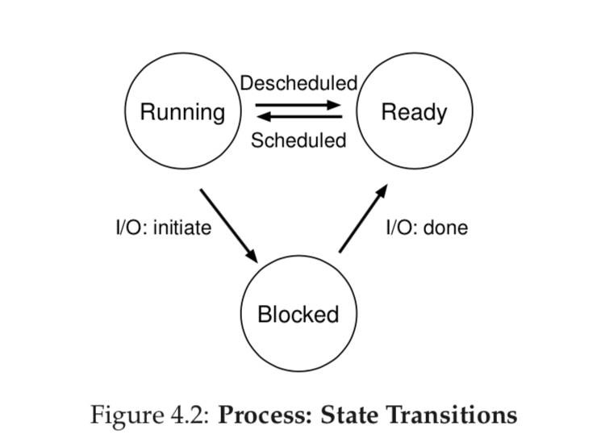
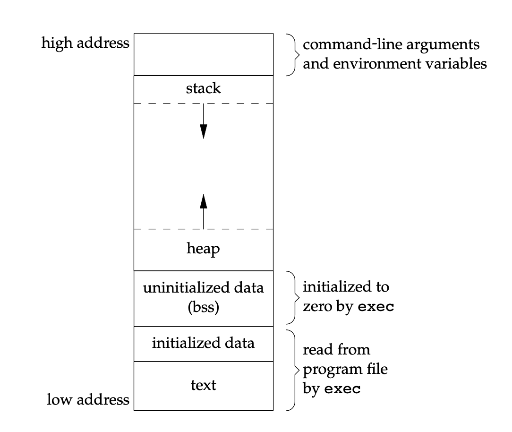

## 操作系统


### 进程和线程的区别和联系

1. 进程是对运行时程序的封装，是系统进行资源分配和调度的基本单元，而线程是进程的子任务，是CPU分配和调度的基本单元。
2. 进程拥有一个完整的资源平台，而线程只独享必不可少的资源，如寄存器和栈；
3. 线程之间可以通过全局变量通信，而进程之间需要使用IPC通信。
4. 线程同样具有状态之间的转换关系，线程能共减少并发执行的时间和空间开销。

线程能够减少开销，体现在以下几个方面：

1. 线程的创建和销毁时间更快。进程在创建的过程中，还需要复制资源的管理信息，而线程之间共享这些信息。同理，线程释放的资源相比进程少很多。
2. 同一个进程中的线程切换比进程切换更快。线程拥有相同的地址空间，意味着线程之间的切换不需要切换页表；进程之间的切换，需要切换也表，这个过程的开销是比较大的（涉及到TLB的失效）。
3. 线程由于共享地址空间，可以通过全局变量通信，不需要经过内核，数据的交互效率更高。

**Linux系统中的实现**

在Linux操作系统中，进程和线程之间的最重要区别是是否共享地址空间。在创建线程的过程中，Linux仅仅把新线程`task_struct`的mm域指向主线程的`mm_struct`地址。

```C
if (clone_flag & CLONE_VM) {
  atomic_inc(&current->mm->mm_users);
  tsk->mm = current->mm
}
```

### 什么时候使用多线程？什么时候使用多进程？

可以使用多线程的场景如下：

1. 如果线程之间需要共享的变量内容过大（例如一个proxy需要缓存接收到的内容，此时需要共享的内存区域较大），可以考虑使用多线程。
2. 

### 线程共享什么变量？独占什么变量？

每个线程都有一个独立的线程上下文，包括以下内容：线程ID、程序计数器、栈、栈顶指针、条件码、通用目的寄存器值。

所有线程共享其余的进程上下文，包括以下内容：只读文本（代码）、读/写数据、堆、共享库代码和数据区域。同时，所有的线程共享打开的文件描述符集合。

### 进程的生命周期



* **运行**：进程正在处理器上运行，执行指令。
* **就绪**：进程可以运行，但由于某些原因，操作系统不选择此时运行该进程。
* **阻塞**：一个进程执行了某个操作，直到完成后才会继续运行。常见的操作是I/O操作。

### 用户模式和内核模式

用户态中的进程不能执行任何特权指令，这些特权指令包括停止处理器、改变模式位、执行I/O操作等。而在内核态中，一个进程可以执行任何指令，并且可以访问系统中任意位置的内存。

用户模式和内核模式之间的切换方式：系统调用、中断、陷阱。

区别用户模式和内核模式的原因在于，操作系统需要提供一种高效可控的进程抽象，需要限制进程可以执行的指令以及可以访问的内存地址范围。

### 上下文切换

内核为每个进程都维护了一个上下文，上下文保存了内核为了恢复一个正在运行的进程所需要的全部状态。通常，进程上下文不仅包含了用户栈、全局变量等用户态空间资源，程序计数器、通用寄存器、浮点寄存去等CPU上下文内容，还包括括了内核栈、内核数据结构（页表、文件表等）等内核空间资源。

为了实现进程上下文的切换，通常会把交换的信息保存在进程的PCB中，当运行另外一个进程的时候，从这个进程的 PCB 取出上下文并恢复，这使得这个进程可以继续执行。

进程的上下文切换会在以下几个时间点发生：

* 当某个进程的时间片耗尽，就会被内核挂起，切换到其他等待的进程。
* 如果进程在执行系统调用的过程中，需要等待某个条件满足后才能执行，此时内核就会挂起该线程，调度另一个进程执行。
* 发生硬件中断时，CPU 上的进程会被中断挂起，转而执行内核中的中断服务程序。

如果在两个线程之间发生上下文切换，根据是否同属于一个线程，执行不同的操作：

* 如果两个线程不是属于同一个进程，切换的过程就跟进程上下文切换一样。
* 如果两个线程属于一个进程，由于共享地址空间，切换过程中虚拟内存之类的资源保持不变，只需要切换线程的私有数据、寄存器等不共享变量。

**Linux中的实现**

上下文切换主要实现以下两个步骤：

* 切换页全局目录，安装一个新的地址空间。
* 切换内核态堆栈和硬件上下文（硬件上下文提供了执行新进程需要的所有信息）。

### fork/vfork/clone（进程创建过程）

fork是Linux中创建一个新进程的方法。fork调用一次，但会返回两次。在子进程中返回值为0，在父进程中返回值为子进程的pid。子进程是父进程的复制，并不共享数据空间、栈，只共享代码段。由于子进程在fork后通常执行exec，Linux对fork的实现进行了写时拷贝的优化，如果子进程或者父进程试图修改一个内存区域，内核只为这个区域制作一块副本。

vfork和fork功能一致，但是在语义上有两点不同：

1. 由于vfork用于父进程fork之后子进程立刻执行exec，所以子进程部分复制父进程的地址空间。如果子进程修改数据、调用函数、没有执行exec就退出，会带来未知的后果。
2. 保证子进程先执行。

clone提供了一种更加精细化的控制，可以由用户决定父子进程之间共享哪些区域，通过flags参数控制进程（线程）之间的共享程度。Linux的线程创建都用到了clone。

* fork等价于clone()
* pthread_create等价于clone()

在底层实现中，clone调用do_fork完成大部分工作，do_fork调用copy_process，然后进程开始执行。copy_process的过程如下：

1. 为新进程创建一个内核栈、thread_info结构和task_struct结构。
2. 检查创建了子进程后，当前用户拥有的进程数目是否超过了系统的资源限制。
3. 子进程把自己和父进程区分开。把大部分进程描述符的成员设为0或者初始化。
4. 设置子进程的状态，保证不会被投入运行。
5. 设置子进程task_struct的flags标志位。
6. 为子进程分配一个有效的pid。
7. 根据clone()的参数，拷贝或者共享打开的文件、文件系统信息、信号处理函数、进程地址空间、命名空间。一般给定进程的所有线程共享这些信息，而不同的进程需要拷贝这些信息。
8. 执行收尾工作并且返回指向子进程的指针。

### 进程销毁过程


### 进程终止的几种方式

五种正常方式：

* main返回
* 调用exit()
* 调用

### 系统调用的执行过程

在用户模式下，进程不能直接执行一些内核代码，需要使用一种手段通知内核用户需要执行系统调用了，让内核执行系统调用的代码。这种通知时通过软中断实现的，通过引发一个异常让内核执行对应的异常处理程序。中断号128对应了系统调用处理程序。

系统调用通常定义了零个或者多个参数，并定义了一个long类型的返回值。Linux通过系统调用号区分不同的系统调用，当需要执行一个系统调用时，这个系统调用号指明了指明了

在执行系统调用处理程序时，必须知道对应的系统调用号是哪一个，这个数字通过参数进行传递，在x86平台上，该参数存储在eax寄存器中。系统调用处理程序验证了系统调用的有效性后，执行对应的系统调用。每个系统调用都需要一定的参数，这些参数存储在寄存器中。系统调用的返回值存储在eax寄存器中。

### 异常和中断

* 中断：硬件异常，是由处理器外面发生的事情引起的。对于执行程序来说，这些相当于外部的系统

### 进程调度算法

进程调度需要尽可能优化以下两个目标：
* **响应时间**：任务首次执行时间减去任务到达时间。
* **周转时间**：任务完成时间减去任务到达时间。

进程调度算法包括先来先服务、最短任务优先、最短完成时间有限、轮转调度、多级反馈队列调度。

**先来先服务（First Come First Server, FCFS）**

按照任务到达时间进行调度。简单，易于实现。会造成耗时较少的任务排在耗时较多任务后面。

**最短任务优先（Shortest Job First, SJF）**

先运行第一个到达的任务，然后运行第二个到达的任务，依此类推。如果所有任务同时到达，可以保证是最优调度。如果任务可以随时到达，不能保证结果最优。

**最短完成时间优先（Shortest Time-to-Completion First, STCF）**

最短任务优先的抢占式版本。每当新任务来临时，判断剩余任务和新任务中那个剩余时间最短，然后调度该任务。平均周转时间大大提升。在响应时间上表现不佳。

**轮转调度（Round-Robin, RR）**

每个任务运行一段固定的时间片，然后换到下一个任务。可以保证响应时间。在平均周转时间上表现不佳。需要选取合适的时间片长度。时间片越短表现越好，但是上下文切换成本越高。

**多级反馈队列调度（Multi-Level Feedback Queue, MLFQ） **

使用多级队列表示优先级，并利用反馈信息决定每个任务当前的优先级。它不需要使用先验知识，而是通过观察工作的运行给出对应的优先级。在运行过程中，使用如下的策略调整优先级：

* 若A优先级高于B，运行A；若A和B优先级相同，轮转运行。
* 任务刚到达时，放在最高优先级。
* 一旦任务用完了在某个优先级的时间配额（无论中间放弃多少次），降低优先级。
* 经过一段时间，将系统的所有任务调回最高优先级，以免进程长期得不到调度产生“饿死”现象。

### Linux调度机制

在Linux 2.6以后，Linux采用完全公平调度（CFS）实现进程调度。

 

### 守护进程、僵尸进程和孤儿进程

守护进程：

僵尸进程：如果一个子进程先于父进程退出，但是父进程还没有对其进行状态收集，这个子进程就是一个僵尸进程。这些子进程的进程描述符还会保留在系统中。如果僵尸进程过多，	那么最终系统资源（进程ID号、分配进程描述符需要的内存）就会耗尽，一个系统无法再创建新的子进程。

孤儿进程：如果父进程先于子进程退出，那么这个子进程就是一个孤儿进程。孤儿进程会被init进程收养并完成状态收集。

### 处理僵尸进程的两种经典方式

* 父进程调用wait()函数，等待子进程退出，然后回收子进程的资源。
* 

### 进程地址空间



进程地址空间分为以下几个部分：

* 代码段：存放二进制代码
* 初始化数据段：存放已经初始化的变量和数据。
* 未初始化数据段：存放没有初始化的变量和数据。
* 堆
* 栈

### 虚拟内存实现机制

虚拟内存采用分页的方式实现。

**分页**

操作系统把内存空间分割成了固定大小的单元，这种思想称之为分页，每一个单元称为一个页。分页的优势有两点：

* 灵活性：操作系统无需知道一个进程如何使用内存空间，能高效提供内存地址抽象。
* 简单性：管理空闲空间更加简便。这些空闲空间没有必要映射到连续的物理内存上，仅需要拿出数量相同的空闲页即可。

从虚拟地址到物理地址的转换由MMU完成，同时，操作系统在内存中为每个进程保存了一个页表，页表的每一项是一个虚拟地址到物理地址的映射。页表存放在物理内存中。一个虚拟地址可以分为两个部分：虚拟页面号和页内偏移量。

当执行地址翻译时，首先从虚拟地址中获取虚拟页号，到页表中找出对应的物理页号，结合页内偏移量得到物理地址。最后利用真正的物理地址得到数据。

**TLB**

使用分页机制存在的问题之一是系统运行速度过慢。TLB可以用于加速地址转换过程。它将频繁发生的虚拟地址和物理地址的转换缓存。

当执行地址翻译时，首先从虚拟地址中获取虚拟页号，然后检查TLB中是否有该页号的转换映射。
* 如果有（TLB hit），直接从TLB中得到物理页号，和偏移量结合得到物理地址。
* 否则，硬件访问页表寻找转换映射，并用该映射更新TLB，完成更新后，重新尝试执行地址翻译的指令。

**多级页表**

多级页表的目的是解决页表占用内存过多的现象，可以去掉大部分页表中的无效项，不要留在内存中。

多级页表的基本思想如下：
* 将页表分割成页大小的单元。
* 如果整页的页表无效，那么不会在内存中分配页表的存储空间。
* 使用页目录表项告知使用页表的页或者整个页的页表包不包含有效页。

多级页表的优势如下：

* 多级页表通常很紧凑，并且支持稀疏的地址空间。
* 页表的每一部分可以整齐的放在一页中，更容易管理内存。

### 页面置换

为了支持巨大的虚拟地址空间，操作系统需要把目前暂时没有用的页缓存起来。一般缓存位置位于磁盘。

如果程序访问的虚拟地址对应的物理地址不存在，就需要通过操作系统处理。这种错误称为页错误，操作系统需要调用缺页处理程序处理（缺页异常处理程序）。为了处理页错误，操作系统采取以下的流程：

* 操作系统需要为换入的页寻找一个物理页。
* 如果没有空闲的物理页，操作系统需要运行页面置换算法，从内存中踢出一些页。
* 通过I/O请求读取该页。
* 更新页表，重新执行需要翻译虚拟地址的指令。

Linux的缺页异常处理程序执行以下的步骤：

1. 判断虚拟地址是否合法。
2. 判断对虚拟地址的访问是否合法。
3. 选择一个牺牲页面，换入新的页面并更新页表。

### 常用页面置换算法

**最优替换**

该算法所选择的被换出的页面将是最长时间内不再被访问，通常可以保证获得最低的缺页率。这是一种理论上的算法，因为无法知道一个页面多长时间不再被访问。

**先进先出**

选择换出的页面是最先进入的页面。该算法会将那些经常被访问的页面也被换出，从而使缺页率升高。

**最近最久未使用（LRU）**

算法思路在于，虽然无法知道将来要使用的页面情况，但是可以知道过去使用页面的情况。LRU 将最近最久未使用的页面换出。

为了实现LRU，需要在内存中维护一个所有页面的链表。当一个页面被访问时，将这个页面移到链表表头。这样就能保证链表表尾的页面是最近最久未访问的。因为每次访问都需要更新链表，因此这种方式实现的LRU代价很高。

**时钟算法**


### LRU代码实现

```c++
class LRUCache {
public:
    LRUCache(int capacity) {
        this->capacity = capacity;
    }
    
    int get(int key) {
        if (mapping.count(key) == 0) {
            return -1;
        } else {
            int value = mapping[key]->second;
            elements.erase(mapping[key]);
            elements.push_front({key, value});
            mapping[key] = elements.begin();
            return value;
        }
    }
    
    void put(int key, int value) {
        if (mapping.count(key) != 0) {
            elements.erase(mapping[key]);
        } else {
            if (elements.size() == capacity) {
                int del = elements.back().first;
                elements.pop_back();
                mapping.erase(del);
            }
        }
        elements.push_front({key, value});
        mapping[key] = elements.begin();
    }

private:
    int capacity;
    unordered_map<int, list<pair<int, int>>::iterator> mapping;
    list<pair<int, int>> elements;
};
```

**关键点**

使用两个数据结构：双向链表和哈希表。双向链表负责存储LRU中的键值对，链表中第一个元素是最近访问的元素，以此类推。哈希表存放每个健和对应的键值对位置。

### malloc底层实现

[https://blog.csdn.net/maokelong95/article/details/51989081](https://blog.csdn.net/maokelong95/article/details/51989081)

glibc malloc采用ptmalloc作为内置的内存分配器。ptmalloc的主要优化点在于多线程的支持上。


### mmap和brk的区别


### 动态内存分配策略

* 最优匹配：遍历空闲链表，找到所有大于等于请求内存大小的空闲块，把其中最小的一块分配出去，剩余的内存添加到空闲链表中。
* 最差匹配：和最优匹配相反，找到空闲链表中最大的一块空闲内存，然后把剩余的空闲内存加入到空闲链表中。
* 首次匹配：遍历空闲链表，直到遇上一个满足内存要求的空闲内存块。
* 下次匹配：和首次匹配类似，区别在于下次匹配需要记录上次匹配成功的空闲链表索引，搜索空闲链表时，从这个索引开始。这种方法避免对内存首部的频繁分配与释放。

### 常见内存分配错误

* 忘记分配内存，可能会导致段错误。
* 没有分配足够的内存，可能会导致缓冲区溢出。
* 忘记初始化已经分配的内存，可能会导致非初始化的内存读取。
* 忘记释放内存，这样会造成内存泄漏。在长时间运行的程序中，如果存在内存泄漏，可能会导致内存不足，重新启动。
* 在用完之前释放内存，会导致空悬指针错误。
* 重复释放内存。
* 错误地调用free。

### 内部碎片和外部碎片

当分配的内存被释放后，可用的内存空间会被分为不连续的小块，这个时候容易产生外部碎片问题。如果空闲内存的总量超过了申请的内存大小，但是由于这些内存并不连续，最后导致内存分配失败，这种情况称为外部碎片。

如果分配程序给出的内存超过了请求的大小，已分配的内存中未被使用的部分就是内部碎片。这种形式的内存浪费发生在已分配单元的内部。

### Linux伙伴系统

Linux伙伴系统为内核提供了一种用于**分配一组连续的页**而建立的一种高效的分配策略，并有效的解决了外碎片问题。

在系统中，空闲空间被视为一块大小为$2^N$的连续内存空间。在Linux中，把所有的空闲页分组为11个块链表。

当向内核请求分配空间时，向上取到$2^i$，然后朝着空闲页块。如果对应的块链表中没有空闲页块，则在更大的页块链表中找。当分配的页块中有多余的页时，伙伴系统根据多余的页框大小插入到对应的空闲页块链表中。

当释放时，内核首先计算出伙伴地址的位置。伙伴满足以下三个条件：两个块具有相同的大小，记作b。(2)它们的物理地址是**连续**的。(3)从同一个更大的块中分配得来。如果找到了该内存块的伙伴，确保该伙伴的所有页都是空闲的，以便进行合并。内存继续检查合并后页块的“伙伴”并检查是否可以合并。

### slab内存分配器

slab用于内核数据结构的分配和释放，可以加快内存的分配和释放速度，同时避免了空闲链表不能全局控制的问题。针对的对象时频繁分配和释放的内存数据结构，例如进程控制快、inode。slab相当于内核通用数据结构的缓存层。

slab把内存划分为不同的高速缓存组，每个高速缓存组放置不同类型的对象，每个对象对应一组高速缓存。分配内存时直接从缓存中取一块空闲的内存，释放的时候直接归还到slab中。slab有以下几个优化点：

* 高速缓存是一块连续的内存空间，这样做避免内存碎片产生。
* 回收的对象可以优先被投入到下一次分配中，这些对象大概率还在CPU高速缓存中，可以提升性能。
* 对存放对象进行着色，均匀映射到不同的缓存行，提升效率。
* 提供了对齐标志，可以按照缓存行对齐，或按照指针对齐。

### Linux虚拟内存系统

Linux内核把进程的虚拟空间视为一些区域的集合，这些区域是已分配的虚拟内存的连续片。不属于某个区域的虚拟内存是不存在的。这种设计允许虚拟地址空间有空隙，哪壶不用记录没有用到的虚拟内存空间。

Linux为每一个进程维护一个mm_struct结构，描述了虚拟内存的当前状态。其中pgd字段指向进程一级页表的基地址，而mmap指向一个由vm_area_structs组成的链表，每个vm_area_structs都描述了一个当前进程空间的一个区域。pgd地址存储在CR3控制寄存器中。

### 进程间通信的方法

进程间通信工具可以根据功能分为三类：

* 通信：关注进程之间的数据交换。
* 同步：关注进程和线程操作之间的同步。
* 信号

通信工具可以在进程之间交换数据，可以被分为以下两类：

* 数据传输工具：要求在用户和内核之间进行两次数据传输。数据传输工具可以分为以下几个类别：
  * 字节流：通过管道、FIFO、字节流socket交换的数据是一个无分隔符的字节流。
  * 消息：通过消息队列、数据报socket交换的数据是一个有分隔符分隔的消息。
* 共享内存：允许进程将数据放在进程共享的一块内存中完成数据的交换。由于通信无需系统调用以及用户和内核之间的数据传输，共享内存的速度非常快。

同步工具可以协调进程的操作，包括了信号量、文件锁。

**管道**


**消息队列**

消息队列

**共享内存**

共享内存解决了管道和消息队列在用户态和内核态之间拷贝数据的过程。消息队列采用虚拟内存的技术，让每个进程都拿出一块虚拟地址空间，映射到相同的物理地址上。一个进程写入的数据，另一个进程可以立马看到，无需在用户态和内核态之间传递数据，提升了进程间通信的速度。共享内存的缺点是没有提供同步机制，需要使用其他的手段实现同步。

**信号量**

信号量是一个整数值，可以使用两个函数来操作它。

* sem_wait()：把信号量值减一，要么立即返回，要么会让调用的线程挂起，直到之后的一个post操作唤醒。
* sem_post()：直接增加信号量的值，如果当前有等待的线程，唤醒其中一个。
* 如果信号量为负值，其绝对值就是等待的线程个数。


**套接字**

套接字用于跨网络的不同主机上的进程之间通信。

**信号**


### 线程同步

线程同步有以下几种方式：互斥量、条件变量、读写锁、自旋锁、屏障。

**互斥量**


**条件变量**


### 为什么条件变量要配合互斥量使用？

为了保护条件变量检查的条件。

假设有下面的代码，父线程调用thr_join, 子线程调用thr_exit。
```C
void thr_exit() {
    done = 1;
    pthread_cond_signal(&c);
}

void thr_join() {
    if (done == 0) {           // p1
        pthread_cond_wait(&c); // p2
    }
}
```
若父线程执行完p1后，操作系统调度子线程执行。子线程执行完毕后退出。此时，父线程继续执行，当执行p2时休眠。在这种情况下，不会有任何线程能够唤醒父线程（此时只有一个线程正在运行），父线程会**一直睡眠**，无法被唤醒。

### 如何实现一个锁

实现锁的想法很简单：用一个变量标志锁是否被占有。第一个线程进入临界区，调用lock，检查标志位是否为1，设置标志位为1。当调用unlock时，设置标志位为0。当其他的线程调用lock时，发现标志位为1，它会在while循环中自旋，直到有线程调用unlock。

但是在while过程中有可能会产生中断，无法保证互斥性。因此，锁的实现需要使用硬件提供的原子操作，这里可以使用test-and-set指令。

```C
static int flag=0;

void lock(){
  while(TestAndSet(&flag,1)==1); // spin-wait
  //flag=1;
}
void unlock(){
  flag=0;
}

int TestAndSet(int *ptr, int new) {
    int old = *ptr;
    *ptr = new;
    return old;
}
```

有些系统提供了compare-and-swap指令。

```C
int CompareAndSwap(int *ptr, int expected, int new) {
  int actual = *ptr;
  if (actual == expected) {
    *ptr = new;
  }
  return actual;
}
```

使用自旋存在一个问题：如果有N个线程同时竞争一个临界区，会浪费掉N-1个时间片。如果让没有竞争到锁的线程直接休眠，那么因为线程调度的不确定性，会造成有的线程被饿死。因此，操作系统构建了休眠队列，如果一个线程没有竞争到锁，直接把自己加入到休眠队列中，通过队列控制谁会获得锁，避免饿死。

不同的操作系统提供了的底层实现，Linux的加锁解锁过程如下。

```

```


### 生产者-消费者问题

**基于互斥量和条件变量**

```C
void *producer(void *arg) {
    int i;
    for (i = 0; i < loops; i++) {
    	Mutex_lock(&m);            // p1
    	while (num_full == max)    // p2
    	    Cond_wait(&empty, &m); // p3
    	do_fill(i);                // p4
    	Cond_signal(&fill);        // p5
    	Mutex_unlock(&m);          // p6
    }

    // end case: put an end-of-production marker (-1) 
    // into shared buffer, one per consumer
    for (i = 0; i < consumers; i++) {
    	Mutex_lock(&m);
    	while (num_full == max) 
    	    Cond_wait(&empty, &m);
    	do_fill(-1);
    	Cond_signal(&fill);
    	Mutex_unlock(&m);
    }

    return NULL;
}
                                                                               
void *consumer(void *arg) {
    int tmp = 0;
    // consumer: keep pulling data out of shared buffer
    // until you receive a -1 (end-of-production marker)
    while (tmp != -1) { 
    	Mutex_lock(&m);           // c1
    	while (num_full == 0)     // c2 
    	    Cond_wait(&fill, &m); // c3
    	tmp = do_get();           // c4
    	Cond_signal(&empty);      // c5
    	Mutex_unlock(&m);         // c6
    }
    return NULL;
}
```

关键点：

* 使用**一个互斥锁**保护临界区数据的读写。
* 使用 `while` 判断条件变量唤醒条件是否满足，防止虚假唤醒。
* 使用**两个条件变量**，保证生产者只能唤醒消费者，消费者只能唤醒生产者。

**基于信号量**


### 死锁

在多进程环境中，若每个进程分别持有特定资源，并且等待其他进程释放持有的资源，在为改变状态的情况下一直保持下去，就会造成死锁。

造成死锁的条件有如下几点：

* 互斥：每种资源只能由一个进程持有。
* 持有并等待：进程持有了资源，并且等待其他进程持有的资源。
* 非抢占： 进程获得的资源不能被抢占。
* 循环等待：进程之间存在一条环路，每个进程持有一个资源，并且等待下一个进程持有的资源。

解决死锁的方法主要有以下几点：死锁预防、死锁避免、死锁检测和恢复。

**死锁预防**

核心思想是破坏产生死锁的四个条件。
* 循环等待：安排锁的获取顺序以避免死锁。
* 持有并等待：通过原子地抢锁解决。实际中，通过提供一个全局锁，保证代码在抢锁的过程中不会出现不合时宜的线程切换。
* 非抢占：系统提供了trylock()方法，会尝试获得锁，如果失败，返回-1。这种方法可能会造成**活锁**，两个线程一直重复这段序列，又都同时抢锁失败。
* 互斥：基于硬件指令，构造无锁数据结构完成相同的功能，例如**CAS（compare-and-swap）**指令。

**死锁避免**

提前获取每个进程关于资源的使用信息，通过调度的方式避免死锁。可以采用诸如银行家算法完成。这类方法的局限性在于适用场景有限并且会限制系统的并发数，实际的使用不多。

**死锁检测和恢复**

允许死锁发生，系统定期检查是否存在死锁情况，如果存在死锁就执行恢复程序。这种方法在数据库系统中有应用。

### 磁盘调度算法

**最短寻道时间优先**

按照I/O请求队列排序，选择寻道时间最短的任务优先完成。这个方法主要的缺点是容易造成磁盘饥饿，离磁头较远的磁道无法完成I/O操作。

**电梯算法**

磁头每次从外到内扫描一遍磁道，如果当前磁道有I/O任务，当时已经被磁头扫描过了，那么就要等到下一次扫描的时候执行I/O操作。

### 文件系统

**数据结构**

在Linux中，和文件相关的数据结构有以下四种：

* 超级块对象：代表一个具体的已安装的文件系统。该对象用于存储特定文件系统的信息。
* 索引节点对象：代表一个具体的文件，包含了内核在操作文件或目录的全部信息。索引节点是文件的唯一表示，它们之间一一对应。如果文件是磁盘文件，索引节点同样需要存储到磁盘上。
* 目录项对象：代表一个目录项，是路径的一个组成部分。路径的每一个组成部分都是一个文件。虽然可以使用索引节点对象表示每一个文件，但是为了方便查找，内核为每一个路径上的文件创建一个目录项对象。目录项纪录了文件的名字、索引节点指针以及与其他目录项的层级关联关系。目录想有内核创建并维护，不用写到磁盘上。
* 文件对象：代表由进程打开的文件，包含了访问模式、当前偏移量。文件对象代表在进程视角下的打开文件，对应唯一一个目录项对象。文件对象有内核创建和维护，不用存储在磁盘上。

**虚拟文件系统**

虚拟文件系统提供了一种对文件系统的统一访问接口，程序不需要了解文件系统的工作原理即可使用提供的统一接口，可以对不同文件系统以及不同存储介质的文件进行读写操作。

**文件的存储**

文件系统把磁盘划分为多个逻辑块，每一个的大小为4KB。一个文件系统把整个磁盘空间划分为以下几个部分：

* 数据区域：用于存放用户的数据。
* inode table：用于存放每个文件的inode。
* 空闲列表：用于指示磁盘中的数据块是空闲的还是被使用的，用于写入文件时分配新的数据块。
* 超级块：用于存储文件系统的信息。

inode中最重要的决定是如何引用数据块的位置，通常有以下几种做法：

* 链表法

在inode中只需要保存一个指向链表头节点的指针，如果需要处理较大的文件，就在这个数据块的末尾添加一个指针。这种做法无法直接访问数据块，只能通过指针顺序访问文件，并且数据块指针消耗了一定的存储空间。

因此，有些文件系统把链接各个数据块的指针显示放在内存的一张链接表中，每个表项存储指向下一个数据块的指针。这种方法提升了访问磁盘的速度，但是不适用于大磁盘。

* 索引法

在inode中保存一组指针，每个指针指向一个属于该文件的数据块。这使得文件的顺序和随机访问都很快。这种方法存在一定局限性，不能支持大文件。

为了支持更大的文件，可以使用一个间接指针，指向一个存储了数据块指针的数据块，这种不平衡树又称为多级索引。这种做法能够灵活的支持小文件和大文件的存放。

**空闲空间管理**

系统为了记录哪个数据块和inode是空闲的，在分配新目录或者文件时就可以很快找到空闲的空间。常见的做法是使用两个位图（inode位图和数据块位图）标识。

**目录的组织**

目录和普通文件的区别在于，目录文件的块里面保存的是目录里面一项一项的文件信息。最简单的保存格式就是列表，就是一项一项地将目录下的文件信息（如文件名、文件 inode、文件类型等）列在表里，如果需要删除一个文件，需要把多赢的条目做一个删除的标记，可以重复使用旧有的空间。

为了加速目录中文件的查找，可以使用哈希表保存目录格式。同时。为了减少 I/O 操作，把当前使用的文件目录缓存在内存，降低磁盘的操作次数，提升文件系统访问速度。

**读写文件的执行过程**


### 海量数据的bitmap使用原理


### 布隆过滤器原理与优点


### 布隆过滤器处理大规模问题时的持久化，包括内存大小受限、磁盘换入换出问题

