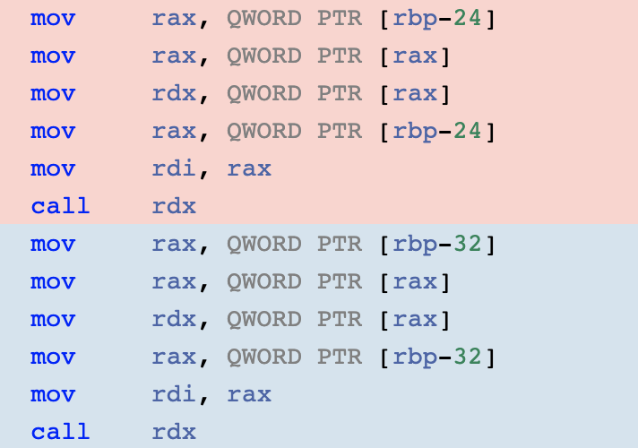

## 语言基础（C/C++）


### 指针和引用的区别

* 指针是一种类型，存在自己的地址，可以通过访问这个地址来修改另一个变量；引用仅仅是一个别名，对引用的操作就是对变量的本身进行操作。
* 指针可以为空，引用不能为空。
* 指针可以是多级的，引用只有一级，不存在引用的引用。
* 引用必须初始化，指针可以不用初始化。
* 引用不能改变目标，指针可以改变目标。

### 堆和栈的区别

* 堆和栈的管理方式不同。栈由操作系统管理分配与释放，而堆需要由程序员手动管理分配与释放，容易造成内存泄漏等问题。
* 堆和栈的生长方向不同。栈向下生长，堆向上生长。
* 堆容易产生内存碎片，内存的频繁分配与释放会导致内存空间的不连续。栈内存永远是后进先出，不存在栈内存中间出现不连续的情况。
* 栈内存的分配由专门的指令支持，分配效率高，有专门的寄存器存放栈的地址，压栈出栈都有专门的寄存器支持。堆内存的分配需要C函数库专门提供，比较复杂，因而耗时更高。
* 栈空间的大小是固定的（Linux下是8M），堆空间的大小几乎没有限制。

#### 堆快一点还是栈快一点？

栈快一点。

* 操作系统会在底层对栈提供支持，会分配专门的寄存器存放栈的地址，栈的入栈出栈操作也十分简单，并且有专门的指令执行，栈的效率比较高也比较快。
* 堆的操作是由C/C++函数库提供的，在分配堆内存的时候需要一定的算法寻找合适大小的内存。并且获取堆的内容需要两次访问，第一次访问指针，第二次根据指针保存的地址访问内存，因此堆比较慢。

### new和delete是如何实现的，new与malloc的异同处

new语句的实现有以下几个步骤：

* 调用operator new函数，分配一块足够大的原始的未命名内存空间。
* 在这块内存上调用对应的构造函数生成相应的对象，并返回内存空间的首地址。

delete语句实现有以下几个步骤：

* 调用对应的析构函数销毁对象。
* 调用operator delete函数，释放对应的内存空间。

new和malloc的不同之处有以下几点：

* malloc仅仅分配一块内存空间，函数不知道内存空间的大小，需要程序员手动传入分配大小的参数。new不仅分配一块对象大小的内存，还会在这块内存上构造对应的对象。
* 程序可以通过重载operator new操作自定义分配内存的行为，程序可以自行控制分配内存的行为。
* new返回的是对象指针，malloc返回的是void*。
* new失败后会抛出bad_alloc异常，并且可以使用set_new_handler设置new失败时会调用的回调函数。而malloc失败后会返回空指针。

### 如何定义一个只能在堆上（栈上）生成对象的类？

#### 只能在栈上

方法：将 new 和 delete 重载为私有。

原因：在堆上生成对象，使用 new 关键词操作，其过程分为两阶段：第一阶段，使用 new 在堆上寻找可用内存，分配给对象；第二阶段，调用构造函数生成对象。将 new 操作设置为私有，那么第一阶段就无法完成，就不能够在堆上生成对象。

#### 只能在堆上

方法：将析构函数设置为私有。

原因：C++ 是静态绑定语言，编译器管理栈上对象的生命周期，编译器在为类对象分配栈空间时，会先检查类的析构函数的访问性。若析构函数不可访问，则不能在栈上创建对象。

### C和C++的区别


### struct和class的区别

* struct默认成员访问权限是public，class默认成员访问权限是private。

* struct的继承默认是public继承，class的继承默认是private继承。

### define和const的区别（编译阶段、安全性、内存占用等）

define在预处理阶段被处理，预处理器会在预编译阶段执行#define的字符串替换；const在编译器期间处理，

const常量具有类型，编译器可以进行安全检查；#define宏定义没有数据类型，只是简单的字符串替换，不能进行安全检查。

内存占用：define不占用

### C++中const的用法

* 修饰变量：表明这个变量是不可变得。
* 

### C++中static的用法

* 修饰普通变量，修改变量的存储区域和生命周期，使变量存储在静态区，在 main 函数运行前就分配了空间，如果有初始值就用初始值初始化它，如果没有初始值系统用默认值初始化它。
* 修饰普通函数，表明函数的作用范围，仅在定义该函数的文件内才能使用。在多人开发项目时，为了防止与他人命名空间里的函数重名，可以将函数定位为 static。
* 修饰成员变量，修饰成员变量使所有的对象只保存一个该变量，而且不需要生成对象就可以访问该成员。
* 修饰成员函数，修饰成员函数使得不需要生成对象就可以访问该函数，但是在 static 函数内不能访问非静态成员。

静态成员函数要访问非静态成员时，要用过对象来引用。局部静态变量在函数调用结束后也不会被回收，会一直在程序内存中，直到该函数再次被调用，它的值还是保持上一次调用结束后的值。

无论是全局静态变量还是局部静态变量，只要是初始化了的就在.data区，未初始化的就在.bss区。

### C++中的const类成员函数（用法和意义），以及和非const成员函数的区别

在一个类中，任何不会修改数据成员的函数都应该声明为const类型。如果在编写const成员函数时，不慎修改数据成员，或者调用了其它非const成员函数，编译器将指出错误，这无疑会提高程序的健壮性。使用const关字进行说明的成员函数，称为常成员函数。只有常成员函数才有资格操作常量或常对象，没有使用const关键字明的成员函数不能用来操作常对象。

const对象只能访问const成员函数，而非const对象可以访问任意的成员函数，包括const成员函数。

### C++的顶层const和底层const

* 顶层const表明指针指向哪个对象不能修改，指向的对象本身可以修改。
* 底层const表明指向的对象不能修改。

### final和override关键字

* 如果一个成员函数被final关键字修饰，那么任何尝试覆盖这个函数的操作都会引发错误。
* 如果一个成员函数被override关键字修饰，说明这个函数是派生类中的虚函数。如果派生类标记了一个不是虚函数的成员函数，编译器会报错。

### 拷贝初始化和直接初始化，初始化和赋值的区别


### extern "C"的用法

C++在编译的过程中会执行符号修饰操作，用于支持C++的复杂特性，而C则没有。如果C++使用了一个C头文件，那么C++编译出来的符号和C的不同，在链接的过程中会出错。此时extern "C"就起作用了：告诉链接器按照C语言的方式处理括号内的代码。

然而，extern “C”在C语言中是错误语法，因此需要使用C++的宏“__cplusplus”判断当前的编译单元是否是C++代码。

extern “C”的用法如下

```C++
#ifdef __cplusplus
extern "C" {
#endif

void *memset(void *, int, size_t);

#ifdef __cplusplus
}
#endif
```

### C++的STL源码（这个系列也很重要，建议侯捷老师的**STL源码剖析**书籍与视频），其中包括内存池机制，各种容器的底层实现机制，算法的实现原理等

STL主要包含以下几个组件：

* 容器：用来存放数据的各种数据结构，如vector、map、list等。容器分为了序列式容器和关联容器。
* 算法：各种常用算法如排序、查找、删除等。
* 迭代器：构建容器和算法之间的胶合剂。每种容器都有自己的迭代器。
* 仿函数：一种重载了operator()的class或者template class，行为类似函数，可以看作算法的某种策略。
* 配接器：用于修饰容器、算法、迭代器的东西。
* 空间配置器：负责内存空间的配置和管理。

### STL中hashtable的实现

STL中的hash表就unordered_map。使用的是哈希进行实现。它记录的键是元素的哈希值，通过对比元素的哈希值来确定元素的值。

unordered_map的底层实现是hashtable，采用开链法（用桶结合链表）来解决哈希冲突。桶的个数都是质数，并且呈现两倍递增的关系，一共有28个。当哈希表的负载因子大于1时，哈希表执行rehash操作。

### 解决哈希冲突的方法

#### 线性探测

在插入过程中，如果哈希函数计算的位置已经被其他的元素占用了，就循环往下寻找，直到找到一个空位为止。查找的过程也是同样。因此，元素删除必须采用惰性删除的方式，只标记删除记号，在resize时才真正删除，为了保证元素的查询可以顺利进行。

线性探测最坏的情况是线性遍历整个表格，平均情况是遍历表格长度的一半。而且，线性探测会出现主集团的情况，所有插入的元素聚集在同一团中，插入操作不断产生碰撞。

#### 二次探测

该元素的哈希值对应的桶不能存放元素时，采用二次函数解决碰撞问题。这样可以缓解主集团的现象，并且不会增加过多的计算开销。

#### 开链

在每一个桶中维护一个链表，由元素哈希值寻找到这个桶，然后将元素插入到对应的链表中，STL的hashtable就是采用这种实现方式。

### STL中unordered_map和map的区别和应用场景

* unordered_map底层基于哈希表实现，提供了常数时间复杂度的查询操作。需要提供对应类型的哈希函数。它内部是无序的，需要实现==操作符。
* map底层基于红黑树实现，插入删除查询时间复杂度都是O(log(n))，它的内部是有序的，因此需要实现比较操作符(<)。

### STL中vector的实现

STL中的vector是封装了动态数组的顺序容器。不过与动态数组不同的是，vector可以根据需要自动扩大容器的大小。具体策略是每次容量不够用时重新申请一块大小为原来容量两倍的内存，将原容器的元素拷贝至新容器，并释放原空间，返回新空间的指针。

#### 为什么是二倍扩容

不同的编译器，vector有不同的扩容大小。这是一种空间和时间的权衡。简单来说， 空间分配的多，平摊时间复杂度低，但浪费空间也多。

使用 k=2 增长因子的问题在于，每次扩展的新尺寸必然刚好大于之前分配的总和，也就是说，之前分配的内存空间不可能被使用。这样对内存不友好。最好把增长因子设为(1,2)，以便内存的重新使用。

采用成倍方式扩容，可以保证常数的时间复杂度，而增加指定大小的容量只能达到 O(n)的时间复杂度，因此，vector使用成倍的方式扩容。

#### vector使用的注意点及其原因，频繁调用push_back()的影响

由于动态增长会引起重新分配内存空间、拷贝原空间、释放原空间，这些过程会降低程序效率。因此，可以使用 reserve(n)预先分配一块较大的指定大小的内存空间，这样当指定大小的内存空间未使用完时，是不会重新分配内存空间的，这样便提升了效率。

如果频繁调用push_back()，会让vector频繁执行“分配新内存——拷贝内容——释放原内存”的过程，降低性能。这个时候可以考虑list。

### vector和list的区别

vector和数组类似，拥有一段连续的内存空间。vector申请的是一段连续的内存，当插入新的元素内存不够时，通常以2倍重新申请更大的一块内存，将原来的元素拷贝过去，释放旧空间。因为内存空间是连续的，所以在进行插入和删除操作时，会造成内存块的拷贝，时间复杂度为O(n)。

list是由双向链表实现的，因此内存空间是不连续的。只能通过指针访问数据，所以list的随机存取非常没有效率，时间复杂度为O(n)； 但由于链表的特点，能高效地进行插入和删除。

vector的迭代器是随机访问迭代器，支持随机访问；list的迭代器是双向迭代器，支持从前向后的遍历或者从后向前的遍历。

vector遍历效率要比list高，因为vector是一块连续的内存空间，底层可以利用空间局部性原理，需要访问的数据已经提前缓存；而list底层实现是链表，它的元素物理上的排列顺序不一定是顺序的。

如果需要高效的随机存取，而不在乎插入和删除的效率，使用vector；如果需要大量的插入和删除，而不关心随机存取，则应使用list。

### STL容器的几种迭代器以及对应的容器（输入迭代器，输出迭代器，前向迭代器，双向迭代器，随机访问迭代器）

* 顺序容器：vector，deque是随机访问迭代器；list是双向迭代器。
* 容器适配器：stack，queue，priority_queue没有迭代器。
* 关联容器：set,map,multiset,multimap是双向迭代器哦；unordered_set，unordered_map，unordered_multiset,unordered_multimap是前向迭代器。

### C++中的重载和重写的区别

* 重载：两个函数有着同样的函数名。但是它们要么参数的个数不同，要么参数的类型不同。如果两个参数仅仅返回值不同，编译器无法决定使用哪个函数。
* 重写：两个函数函数名相同，参数列表相同，只有方法体不相同的实现方法。一般用于子类继承父类时对父类方法的重写。子类的同名方法屏蔽了父类方法的现象称为隐藏。

### C++内存管理

在SGI STL中，采用两级配置器管理方式：

* 一级配置器：一级配置器是对malloc/free函数的封装，allocate()调用malloc函数，deallocate()调用free函数。
* 二级配置器：如果内存的需求大于128bytes，那么使用第一级配置器；额外维护了16个自由链表，负责16种小型区块的配置能力。这个内存池由malloc分配得来。如果内存不足，转而使用第一级配置器配置足够的空间给第二级配置器，然后再次尝试内存的分配过程。

如果使用二级配置器分配内存，并且面临内存不够的场景，此时需要向内存池申请新的内存。内存池有以下几种申请结果：

* 完全满足申请需求。直接返回分配内存的首地址即可。
* 部分满足申请需求。不能满足全部申请的内存大小，但是可以满足一块以上的内存需求。直接返回分配内存的首地址即可，修改申请内存大小的参数，告知真正的申请数量。
* 完全无法满足申请需求。此时使用malloc申请一块新的内存，如果malloc也不能满足要求，就从空闲链表中查找是否存在剩余的空闲块可以满足需求，如果有就释放给内存池。内存池获得一些新的内存后配置器重新调用内存分配函数。

### 面向对象的三大特性

面向对象的三大特性是：封装，继承和多态。

* 封装隐藏了类的实现细节和成员数据，实现了代码模块化，如类里面的private和public；
* 继承使得子类可以复用父类的成员和方法，实现了代码重用；
* 多态则是“一个接口，多个实现”，通过父类调用子类的成员，实现了接口重用，如父类的指针指向子类的对象。

### C++多态的实现

* 重载多态（Ad-hoc Polymorphism，编译期）：函数重载、运算符重载

* 子类型多态（Subtype Polymorphism，运行期）：虚函数

* 参数多态（Parametric Polymorphism，编译期）：类模板、函数模板

* 强制多态（Coercion Polymorphism，编译期/运行期）：基本类型转换、自定义类型转换

### C++虚函数相关（虚函数表，虚函数指针），虚函数的实现原理

#### 虚函数表和虚函数指针

虚函数表实现了C++多态机制，虚函数表是每个类中存放虚函数地址的指针数组，类的实例在调用函数时会在虚函数表中寻找函数地址进行调用，如果子类覆盖了父类的函数，则子类的虚函数表会指向子类实现的函数地址，否则指向父类的函数地址。一个类的所有实例都共享同一张虚函数表。

#### 虚函数的实现原理

为了实现多态，编译器做了以下的工作：

* 为每一个class指定一个字符串或者数字，表明这个类的类型。
* 为每个class设置一个指针，这个指针指向一个表格，这个表格含有所有的虚函数执行期地址。
* 为了找到虚函数的地址，每个虚函数指派了一个虚函数表索引值。

在编译的过程中，编译器只需要知道这个虚函数的索引值，即可改写代码调用对应索引值的函数，实现多态。

在多重继承的环境下，子类中存在多个虚函数指针，每个指向不同的虚函数表，因而需要对第二个及之后的父类的this指针做出调整。

C++编译器普遍采用thunk机制解决这个问题，thunk是一小段汇编代码，首先使用适当的offset调整this指针，然后跳转到virtual function上。虚函数表的slot可以指向一段thunk。thunk的伪码如下：

```C++
p = this + top_offset // p = this - 8
call echo(p)
```

thunk在实际中一般采用虚函数实现。

top_offset存储在虚函数表中，一般位于虚表的第一个slot中。

#### 为什么基类指针指向派生类对象时可以调用派生类成员函数

使用基类指针指向派生类对象，如果调用的是虚函数，编译器会从指向对象的虚函数表中找到对应的函数指针，此时虚函数表指向的函数指针是派生类的实现，因此调用的是派生类的成员函数。

#### 基类的虚函数存放在内存的什么区

虚函数表是一个数组，存放的是函数指针，不是程序代码，所以不在代码段。

虚函数表是全局共享的元素，全局仅有一个。虚函数的大小可以在编译器确定，所有虚函数的地址也可以在编译器确定。虚函数表类似于类中静态成员变量。静态成员变量也是全局共享，大小确定。

虚函数表vtable在Linux/Unix中存放在可执行文件的只读数据段中(.rodata)。

#### 虚函数表指针vptr的初始化时间

虚函数指针在构造函数中初始化。构造函数执行完基类的构造函数后，就会初始化派生类的虚函数表指针。

### C++中类的数据成员和成员函数内存分布情况

#### 数据成员分布

对于non-static数据成员，C++直接把它们放到一个class object中，没有强制的排序顺序要求。仅有的要求是，在同一个access section（public、private、protected），较晚出现的class member出现在较高的地址中。

对于static数据成员，被编译器放在class object外，作为一个全局变量，放在数据段。

一个类的大小收到以下几个方面的因素：

* 语言本身造成的额外负担：如支持多态就需要存放一个虚函数表指针。
* 编译器对于特殊情况的优化处理：如空类的大小为1。
* 内存对齐的限制。

对于带有继承的类，派生类的部分不能和基类的部分捆绑在一起，这样做有可能在拷贝基类的数据时破坏了派生类的数据。

#### 成员函数分布

* 非静态成员函数：首先更改签名，添加this指针作为参数，然后把函数内部所有的成员访问都使用this改写，然后通过函数改名成为一个新的函数。
* 虚函数：通过虚函数表以及虚函数指针在运行期决定调用那个函数。
* 静态成员函数：转为一般的函数调用。

### this指针

this指针用于类内部，再类的非静态成员函数中访问非静态成员时，编译器自动将this指针传递为一个参数，对各成员的访问通过this函数进行。

this指针总是指向当前对象，因此this是一个常量指针`ClassName *const `，不允许应用程序改变this指针保存的地址。

### 析构函数一般写成虚函数的原因

如果基类指针指向一个派生类对象，当执行析构过程时，如果基类的析构函数不是虚函数，那么调用的是基类的析构函数，无法正确释放派生类的资源，造成内存泄漏。如果基类的析构函数是一个虚函数，编译器可以根据虚函数表寻找到子类的析构函数进行调用，从而正确释放子类对象的资源。

### 构造函数、拷贝构造函数和赋值操作符的区别

* 构造函数：对象不存在，没用别的对象初始化
* 拷贝构造函数：对象不存在，用别的对象初始化
* 赋值运算符：对象存在，用别的对象给它赋值

### explicit关键字

* 修饰构造函数时，防止隐式转换和复制初始化。
* 修饰重载运算符时，防止隐式转换，但按语境转换除外（如operator bool）。

### 构造函数为什么一般不定义为虚函数

虚函数的调用需要虚函数表指针，而该指针是在构造函数中被初始化的。若构造函数声明为虚函数，那么由于对象还未创建，虚函数指针没有被初始化，更没有虚函数表地址用来调用虚函数即构造函数了。

### 构造函数的几种关键字(default delete 0)

* =default：将拷贝控制成员定义为=default显式要求编译器生成合成的版本

* =delete：将拷贝构造函数和拷贝赋值运算符定义删除的函数，阻止拷贝（析构函数不能是删除的函数 C++Primer P450）
* =0：将虚函数定义为纯虚函数（纯虚函数无需定义，=0只能出现在类内部虚函数的声明语句处；当然，也可以为纯虚函数提供定义，不过函数体必须定义在类的外部）

### 构造函数或者析构函数中调用虚函数会怎样

在继承体系中，首先调用基类的构造函数，然后调用子类的构造函数。继承类的虚函数表指针在调用继承类的构造函数时初始化。如果在在基类的构造函数中执行虚函数，虚函数执行的版本是基类实现的版本，而不是继承类实现的版本。

析构函数同理，继承类的虚函数表指针在继承类析构过程中指向基类的虚函数表。此时如果在基类的析构函数中调用虚函数，执行的一定会是基类实现的版本。

### 纯虚函数

纯虚函数是只有定义没有实现的函数，

如果一个类声明了纯虚函数，那么这个类就是一个虚基类，这个类不能被实例化，只有继承了这个类的子类可以实例化。

纯虚函数更加类似于接口的概念，提供了一种统一的接口，具体的实现交给虚基类的子类实现。

### 静态类型和动态类型，静态绑定和动态绑定的介绍（待查）

- 静态类型：对象在声明时采用的类型，在编译期既已确定。
- 动态类型：通常是指一个指针或引用目前所指对象的类型，是在运行期决定的。
- 静态绑定：绑定的是静态类型，所对应的函数或属性依赖于对象的静态类型，发生在编译期。
- 动态绑定：绑定的是动态类型，所对应的函数或属性依赖于对象的动态类型，发生在运行期。

可见，非虚函数一般都是静态绑定，虚函数一般都是动态绑定。

#### 引用是否能实现动态绑定，为什么引用可以实现



引用和指针都能实现动态多态，方法都是使用虚函数表找到对应的虚函数指针，调用对应的虚函数。

### 深拷贝和浅拷贝的区别（举例说明深拷贝的安全性）

浅拷贝指的是仅仅拷贝了指向对象的指针，指针指向的底层数据没有拷贝。

深拷贝开辟了一块新的内存，把原来指针指向的底层数据拷贝到新开辟的内存空间中。

深拷贝可以避免写冲突，一个对象的写不会被另一个对象看到。并且，可以避免重复释放，没个对象指针指向的底层数据是唯一的。

### 介绍C++所有的构造函数


### 什么情况下会调用拷贝构造函数（三种情况）

* 对象以值传递的方式传入函数参数。
* 对象以值方式从返回值返回。
* 对象通过另一个同类型对象初始化。

### 结构体内存对齐方式，为什么要进行内存对齐？

字节对齐的作用是提高系统的性能。如果一个数据没有对齐，那么需要更多的内存读取次数。

字节对齐遵循的原则是，任何K字节的基本对象的起始地址必须是K的倍数。如果在结构体中，需要在字段中插入间隙，保证每个字段都能满足对齐要求。另外，结构体的末尾也有可能需要填充字符，保证在数据中，每个元素满足对齐要求。

### 内存泄露的定义，如何检测与避免？

如果程序通过动态内存分配内存空间，使用完毕后没有手动释放，导致内存一直被占用的现象，成为内存泄漏。

造成内存泄漏的原因：

* new/delete没有配套使用。
* 释放数组时没有使用delete[]，仅使用了delete。
* 没有将基类的析构函数定义为虚函数，当基类指针指向派生类对象时，如果积累的析构函数不是虚函数，那么不会调用派生类的虚函数，子累的资源没有正确释放，造成内存泄漏。
* 没有正确释放数据成员的内存。

避免方法：

* 采用RAII类或者智能指针管理动态内存的分配与释放。
* 将基类的析构函数设置为虚函数。

### 智能指针

智能指针一共有四种类型：unique_ptr、shared_ptr、weak_ptr、auto_ptr。


#### 智能指针的循环引用

如果两个对象分别持有指向对方的shard_ptr，会阻止这两个对象的析构，即使其他的数据结构已经不能访问这两个对象了，他们的引用计数仍然为1。这就发生了内存泄漏事件，这两个对象已经没有用了，但是程序无法回收内存空间。

解决方法是使用weak_ptr，它指向一个对象，但是不增加对象的引用计数。weak_ptr可以跟踪指针何时空悬。判断指向的对象是否已经析构。

### 遇到coredump要怎么调试

coredump是程序由于异常或者bug在运行时异常退出或者终止，在一定的条件下生成的一个叫做core的文件，这个core文件会记录程序在运行时的内存，寄存器状态，内存指针和函数堆栈信息等等。对这个文件进行分析可以定位到程序异常的时候对应的堆栈调用信息。

通常使用gdb调试

```shell
gdb [可执行文件名称] [core文件名称]
```

### 内存检查工具的了解


### 模板的用法与适用场景


### 成员初始化列表

成员初始化列表就是在类或者结构体的构造函数中，在参数列表后以冒号开头，逗号进行分隔的一系列初始化字段。成员初始化列表中的成员直接执行对应的构造函数，其他成员执行的是默认构造函数，如果在构造函数体中赋值，执行的是拷贝运算。

**为什么用成员初始化列表会快一些（性能优势）？**

使用成员初始化列表执行的是直接初始化的操作，直接使用传入的参数初始化成员对象，省去了执行一次默认构造函数的时间，否则会调用一次传入参数的默认构造函数。所以使用成员初始化列表效率会高一些

有些情况下必须使用成员初始化列表：

* 引用成员的初始化。
* 常量成员的初始化。
* 没有默认构造函数的初始化。

### C++的调用惯例（简单一点C++函数调用的压栈过程）

* 参数传递：从右往左的顺序将参数压入栈中。
* 出栈方：函数调用者。
* 返回值：放在%eax中。

### C++的四种强制转换

#### static_cast

任何具有明确定义的类型转换，只要不涉及到底层const，都可以说使用static_cast转换。

* 可以把一个较大的算术类型付给一个较小的算术类型。
* 编译器不执行警告。
* 可以在整个类层次结构中移动指针，子类转化为父类安全（向上转换），父类转化为子类不安全（因为子类可能有不在父类的字段或方法）。

#### dynamic_cast

用于父类指针和子类指针之间，父类引用和子类引用之间的类型转换。执行运行时类型检查。

如果目标类型和原类型不再同一个继承关系中，转换失败。如果是指针类型，转换失败返回0，如果是引用类型，抛出出bad_cast异常。

#### const_cast

用于删除 变量的const、volatile 和 __unaligned 特性。

#### reinterpret_cast

用于运算对象位模式的简单重新解释。

* 使用非常危险，编译器不会因为类型改变给出任何警告信息。
* 允许指针类型之间的相互转换，指针与证书类型之间的相互转换。

### C++中将临时变量作为返回值的时候的处理过程（栈上的内存分配、拷贝过程）

* 函数调用方在栈上开辟一块空间作为临时变量。
* 将临时变量的地址作为隐藏参数传入函数中。
* 函数将返回值拷贝到临时对象中，将临时对象的地址放在%eax中。
* 函数调用方根据地址，把临时对象拷贝到真正的返回值中。

### C++的异常处理


### volatile关键字

volatile用于指示编译器，当前变量指向的内存不是一块普通的内存，不要使用常用的优化手段优化对该对象的访问代码。

volatile关键字声明的变量，每次访问时都必须从内存中取出值（没有被 volatile 修饰的变量，可能由于编译器的优化，从 CPU 寄存器中取值）

### 优化程序的几种方法


### public，protected和private访问权限和继承


### inline和宏定义的区别

inline表示内联展开，这是一个提供了编译器的声明，编译器并不一定会执行内联展开。如果编译器接受了内联展开的要求，在执行inline函数时候，如果

### C++和C的类型安全


### C++从源文件到可执行文件的过程

从源文件到目标文件的过程为：预编译、编译、汇编、链接。

* 预处理：根据#字符修改原始程序。
* 编译：生成汇编语言程序。
* 汇编：根据汇编语言程序生成可重定位目标文件。
* 链接：把目标文件链接起来生成可执行目标文件。
